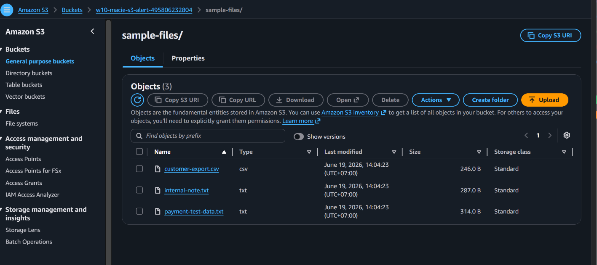
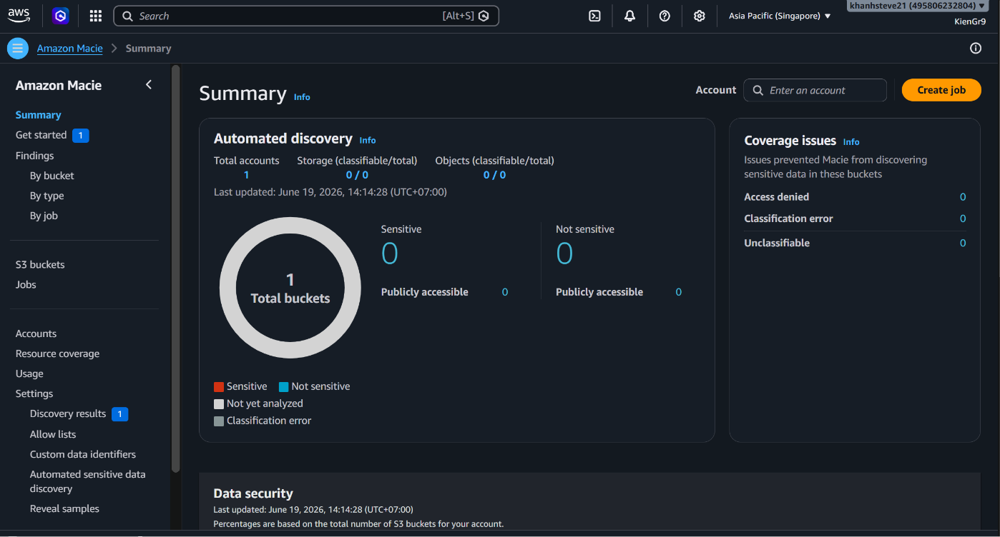
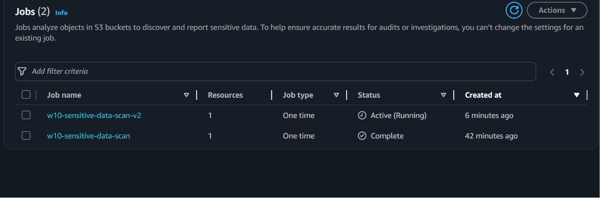
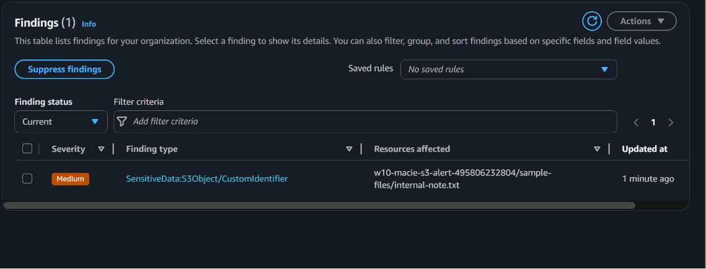
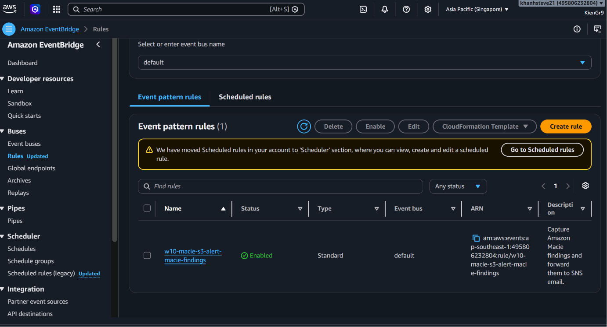
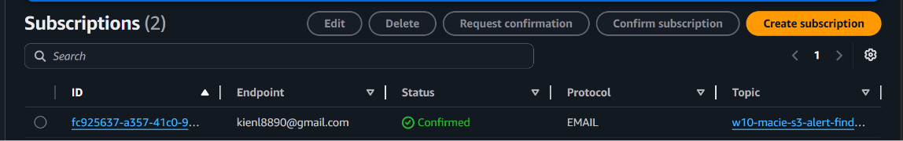
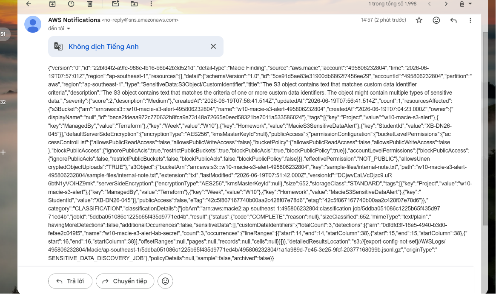

# Homework 04 - Detect Sensitive Data in S3 with Amazon Macie

Bài này tạo một luồng phát hiện dữ liệu nhạy cảm trong S3 bằng Amazon Macie và gửi cảnh báo qua email.

Luồng chính:

```text
sample-data/ -> S3 Bucket -> Amazon Macie Classification Job -> Macie Finding -> EventBridge -> SNS -> Email
```

## Resource được tạo

- S3 bucket riêng cho bài lab.
- S3 public access block, versioning và server-side encryption.
- Sample files upload tự động vào S3 từ folder `sample-data/`.
- Amazon Macie account enable trong region đang dùng.
- Macie custom data identifier cho chuỗi demo dạng `CONFIDENTIAL_CUSTOMER_SECRET_...`.
- Macie one-time classification job quét bucket với sampling `100%`.
- SNS Topic và email subscription.
- EventBridge rule bắt `Macie Finding` và gửi sang SNS.

## Chưa có file data thì làm sao?

Không cần tự chuẩn bị data thật. Folder `sample-data/` đã có sẵn vài file giả lập:

- `customer-export.csv`: email và số điện thoại giả.
- `payment-test-data.txt`: số thẻ test phổ biến dùng cho lab.
- `internal-note.txt`: ghi chú nội bộ giả, có chuỗi custom để Macie chắc chắn tạo finding trong lab.

Terraform dùng `aws_s3_object` để upload toàn bộ file trong `sample-data/` lên S3 prefix `sample-files/`. Không đưa dữ liệu khách hàng thật vào repo.

## Cách chạy

1. Copy file biến mẫu:

```bash
cp terraform.tfvars.example terraform.tfvars
```

2. Sửa `terraform.tfvars` hoặc để Terraform hỏi email:

```hcl
notification_email = "your-email@example.com"
```

Nếu muốn Terraform hỏi email khi chạy `plan/apply`, hãy để dòng này bị comment:

```hcl
# notification_email = "your-email@example.com"
```

Phải thay bằng email thật của bạn, ví dụ:

```hcl
notification_email = "kien@example.com"
```

Không giữ nguyên `your-email@example.com`, vì SNS sẽ tạo subscription pending nhưng bạn sẽ không nhận được email xác nhận.

3. Chạy Terraform:

```bash
terraform init
terraform plan
terraform apply
```

4. Mở email và bấm xác nhận SNS subscription.

Nếu lỡ `terraform apply` khi còn email placeholder, sửa lại `terraform.tfvars` thành email thật rồi chạy:

```bash
terraform apply -replace=aws_sns_topic_subscription.email
```

Sau đó vào email thật và bấm confirm subscription.

5. Vào Amazon Macie để theo dõi classification job:

```bash
terraform output macie_job_name
terraform output s3_bucket_name
```

Macie có thể mất vài phút để job chuyển sang `Complete` và finding xuất hiện.

## Kiểm tra bằng AWS CLI

```bash
aws s3 ls "$(terraform output -raw sample_s3_prefix)"
aws macie2 list-classification-jobs --region "$(terraform output -raw aws_region 2>/dev/null || echo ap-southeast-1)"
aws events describe-rule --name "$(terraform output -raw eventbridge_rule_name)"
```

Nếu AWS CLI không lấy được `aws_region` từ output thì dùng region trong `terraform.tfvars`, mặc định là `ap-southeast-1`.

## Lỗi thường gặp

### Completed Macie job không destroy được

Macie one-time classification job là resource gần như immutable. Nếu job đã `Complete`
rồi bạn đổi cấu hình job, Terraform có thể cố destroy job cũ và gặp lỗi:

```text
cannot update completed job
```

Trong lab này có thể bỏ job cũ khỏi Terraform state để tạo job mới:

```bash
terraform state rm aws_macie2_classification_job.s3_sensitive_data
terraform apply
```

Lệnh `state rm` không xoá job trên AWS, chỉ bỏ job cũ khỏi Terraform state.

## Evidence cần chụp

Lưu ảnh vào folder:

```text
evidence/
```

Gợi ý tên ảnh:

- `01-s3-sample-files-uploaded.png`: S3 bucket có các file trong prefix `sample-files/`.
- `02-macie-enabled.png`: Amazon Macie enabled trong region.
- `03-macie-classification-job-complete.png`: Macie classification job đã được tạo và xử lý bucket.
- `04-macie-finding-sensitive-data.png`: Finding phát hiện sensitive data trong S3.
- `05-eventbridge-rule-macie-finding.png`: EventBridge rule bắt source `aws.macie`.
- `06-sns-subscription-confirmed.png`: SNS email subscription đã `Confirmed`.
- `07-email-alert-received.png`: Email nhận alert từ SNS.

## Evidence

Phần này chứng minh file mẫu đã được upload lên S3, Amazon Macie đã quét bucket,
tạo finding, EventBridge bắt finding đó và SNS gửi cảnh báo về email.

### 1. S3 sample files uploaded

S3 bucket chứa các file mẫu được Terraform upload từ `sample-data/`.

Vào AWS Console:

```text
S3 -> Buckets -> w10-macie-s3-alert-<account-id> -> sample-files/
```

Chụp màn hình thấy các object:

```text
customer-export.csv
internal-note.txt
payment-test-data.txt
```



### 2. Macie enabled

Amazon Macie đã được bật trong region của bài lab.

Vào AWS Console:

```text
Amazon Macie -> Summary
```

Chụp màn hình thấy Macie đang enabled hoặc dashboard Macie hiển thị bình thường.



### 3. Classification job created

Macie classification job được tạo để quét bucket. Finding và email ở các bước sau chứng minh job đã xử lý dữ liệu và tạo kết quả.

Vào AWS Console:

```text
Amazon Macie -> Jobs -> w10-sensitive-data-scan-v2
```

Chụp màn hình thấy job `w10-sensitive-data-scan-v2`, target bucket là bucket của bài lab và sampling là `100%`.



### 4. Macie finding sensitive data

Finding cho thấy Macie phát hiện dữ liệu nhạy cảm trong object S3.

Vào AWS Console:

```text
Amazon Macie -> Findings
```

Chụp màn hình finding liên quan bucket `w10-macie-s3-alert-<account-id>`. Nếu có thể,
mở detail của finding để thấy S3 object, category/type của sensitive data và severity.
Finding nên liên quan custom data identifier hoặc object `internal-note.txt`.



### 5. EventBridge rule

EventBridge rule bắt event `Macie Finding` từ source `aws.macie`.

Vào AWS Console:

```text
Amazon EventBridge -> Rules -> w10-macie-s3-alert-macie-findings
```

Chụp màn hình thấy event pattern có `source: aws.macie`, `detail-type: Macie Finding`
và target là SNS topic `w10-macie-s3-alert-findings-topic`.



### 6. SNS subscription confirmed

Email subscription của SNS đã được xác nhận.

Vào AWS Console:

```text
SNS -> Topics -> w10-macie-s3-alert-findings-topic -> Subscriptions
```

Chụp màn hình thấy protocol `email`, endpoint là email của bạn và status `Confirmed`.



### 7. Email alert received

Email nhận được alert khi Macie finding được gửi qua EventBridge và SNS.

Vào mailbox của email đã đăng ký SNS.

Chụp email từ AWS Notifications. Nội dung nên thể hiện event/finding đến từ Amazon Macie
hoặc SNS topic của bài lab. Nếu chưa thấy email ngay, chờ Macie publish finding hoặc kiểm
tra lại SNS subscription đã confirmed.



## Dọn dẹp

```bash
terraform destroy
```

Macie có tính phí theo dữ liệu quét và thời gian sử dụng. Sau khi chụp evidence xong nên destroy resource lab.
