# W10 Evidence Checklist

File này gom evidence cho 3 phần của W10:

- Lab sáng: RBAC + Gatekeeper Admission.
- Lab chiều: ESO + Trivy + Cosign + Sigstore Policy Controller.
- Challenge: Payments tenant.

Mỗi mục nên có ảnh ArgoCD hoặc output terminal tương ứng. Nếu nộp bằng Markdown, paste output vào dưới từng mục.

## Kết quả chính

| Trạng thái | Evidence | Nội dung chứng minh |
| --- | --- | --- |
| [x] | `screenshots/04-argocd-applications-overview.png` | Tổng quan ArgoCD Applications. |
| [x] | `screenshots/05-rbac-users-can-i.png` | RBAC Lab 1.1: `alice`, `bob`, `carol` đúng quyền. |
| [x] | `screenshots/06-gatekeeper-core-deny-rejections.png` | Gatekeeper Lab 1.2 reject image `latest`, thiếu limits, root user, hostNetwork. |
| [x] | `screenshots/07-gatekeeper-allow-secure-pod-running.png` | Manifest hợp lệ pass admission. |
| [x] | `screenshots/08-gatekeeper-owner-label-rejections.png` | Custom owner label policy reject workload thiếu `owner`. |
| [x] | `screenshots/09-gatekeeper-owner-workloads-pass.png` | Workload hợp lệ có `owner` pass. |
| [x] | `screenshots/01-eso-secret-initial-and-consumer-log.png` | ESO sync `db-secret` và app đọc được secret ban đầu. |
| [x] | `screenshots/02-eso-secret-rotation-log.png` | Secret rotate thành công, pod không cần restart. |
| [x] | `screenshots/10-ghcr-pull-secret-api-running.png` | ESO tạo `ghcr-pull-secret`, API pull private image và Running. |
| [x] | `screenshots/03-cosign-verify-w10-api.png` | `cosign verify` pass cho image `w10-api:0.0.4`. |
| [x] | `screenshots/11-sigstore-controller-and-policy-start.png` | Sigstore Policy Controller webhook và policy bắt đầu hoạt động. |
| [x] | `screenshots/12-sigstore-policy-ready-and-namespace-labels.png` | `ClusterImagePolicy` Ready và namespace bật label enforce. |
| [x] | `screenshots/13-payments-rbac-isolation.png` | `payments-dev` bị cô lập đúng trong namespace `payments`. |
| [x] | `screenshots/15-payments-quota-resourcequota-reject.png` | ResourceQuota chặn workload vượt ngân sách. |
| [x] | `screenshots/16-payments-limitrange-default-resources.png` | LimitRange tự cấp default resources. |
| [x] | `screenshots/19-payments-networkpolicy-cross-namespace-block.png` | NetworkPolicy runtime chặn gọi chéo từ `payments` sang service `demo` trên cluster có Calico. |
| [x] | `screenshots/17-payments-app-running-and-owner-policy-reject.png` | App `payments-api` chạy và constraint cũ reject manifest vi phạm. |
| [x] | `screenshots/18-secret-scan-no-real-patterns.png` | Không có AWS key, GitHub PAT, private key thật trong repo. |
| [~] | `screenshots/14-payments-quota-superseded-limitrange-block.png` | Ảnh trace lúc test quota bị LimitRange chặn trước, không dùng làm evidence cuối. |

## 0. Trạng thái GitOps chung

```bash
kubectl get applications -n argocd
kubectl get ns demo payments argocd gatekeeper-system external-secrets cosign-system
```

Kỳ vọng:

```text
root, app-api, security-rbac, gatekeeper, eso, policy-controller, supply-chain-policies, payments, payments-app đều Synced/Healthy.
Namespace demo và payments tồn tại.
```

Evidence:

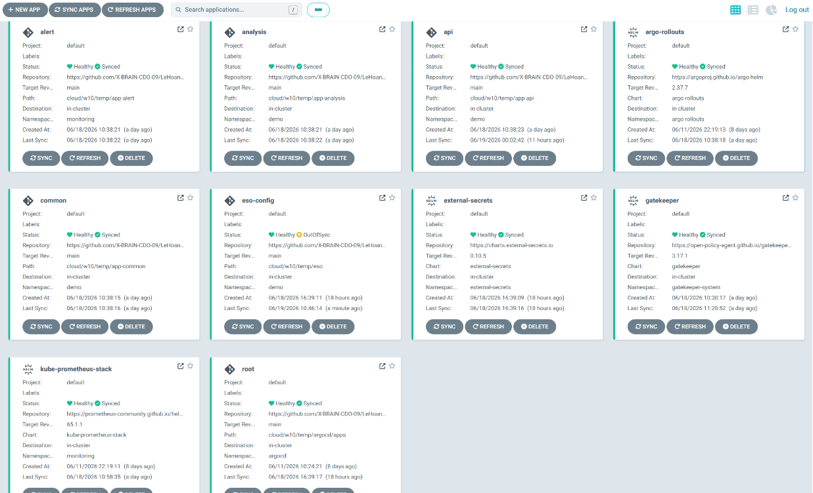

_ArgoCD quản lý các Application chính của W10._

## 1. Lab sáng - RBAC

```bash
kubectl auth can-i create deploy -n demo \
  --as alice

kubectl auth can-i create deploy -n kube-system \
  --as alice

kubectl auth can-i get pods -A \
  --as bob

kubectl auth can-i delete nodes \
  --as carol

kubectl auth can-i list pods -n demo \
  --as system:serviceaccount:demo:api
```

Kỳ vọng:

```text
alice create deploy -n demo        -> yes
alice create deploy -n kube-system -> no
bob get pods -A                    -> yes
carol delete nodes                 -> no
api list pods -n demo              -> yes
```

Evidence:

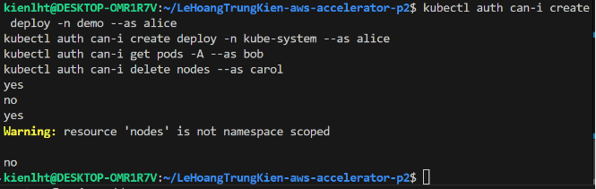

_Kết quả `kubectl auth can-i` cho `alice`, `bob`, `carol` đúng với ma trận RBAC._

## 2. Lab sáng - Gatekeeper Admission

Kiểm tra controller và constraints:

```bash
kubectl get pod -n gatekeeper-system
kubectl get constraints
kubectl get application security-gatekeeper-constraints -n argocd
```

Test manifest vi phạm:

```bash
kubectl apply -f cloud/w10/temp/security-rbac-admission/gatekeeper/tests/test-deny-latest.yaml
kubectl apply -f cloud/w10/temp/security-rbac-admission/gatekeeper/tests/test-deny-missing-limits.yaml
kubectl apply -f cloud/w10/temp/security-rbac-admission/gatekeeper/tests/test-deny-root-user.yaml
kubectl apply -f cloud/w10/temp/security-rbac-admission/gatekeeper/tests/test-deny-host-network.yaml
kubectl apply -f cloud/w10/temp/security-rbac-admission/gatekeeper/tests/test-deny-missing-owner.yaml
kubectl apply -f cloud/w10/temp/security-rbac-admission/gatekeeper/tests/test-deny-unapproved-registry.yaml
```

Test manifest hợp lệ:

```bash
kubectl apply -f cloud/w10/temp/security-rbac-admission/gatekeeper/tests/test-allow-secure-pod.yaml
kubectl apply -f cloud/w10/temp/security-rbac-admission/gatekeeper/tests/test-allow-owner-workloads.yaml
kubectl get pod,deploy,rollout -n demo
```

Kỳ vọng:

```text
test-deny-* bị reject bởi Gatekeeper.
test-allow-* apply được.
Rollout api hiện tại không bị chính policy chặn.
```

Evidence:

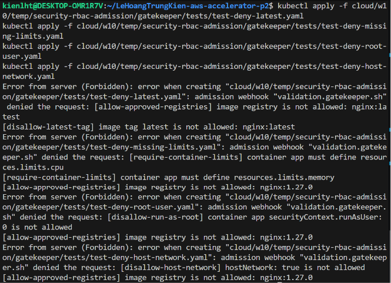

_Gatekeeper reject các manifest vi phạm policy lõi: `latest`, thiếu limits, root user, hostNetwork._

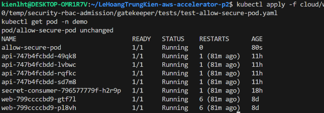

_Manifest hợp lệ pass admission và pod `allow-secure-pod` chạy được._

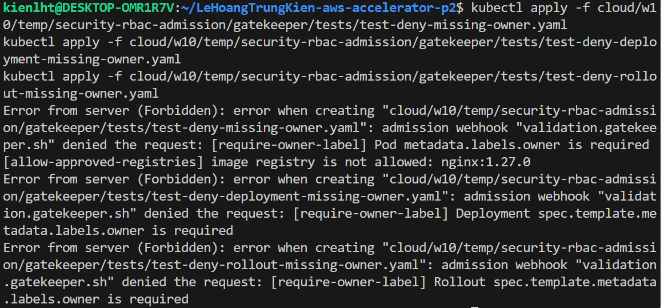

_Custom owner policy reject Pod, Deployment, Rollout thiếu label `owner`._

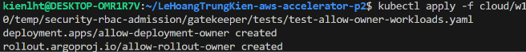

_Workload có label `owner` hợp lệ được tạo thành công._

## 3. Lab chiều - External Secrets Operator

Kiểm tra ESO và SecretStore:

```bash
kubectl get pod -n external-secrets
kubectl get secretstore aws-store -n demo
kubectl describe secretstore aws-store -n demo
kubectl get externalsecret db-creds -n demo
kubectl get secret db-secret -n demo
```

Kiểm tra secret được sync:

```bash
kubectl get secret db-secret -n demo -o jsonpath='{.data.password}' | base64 -d; echo
kubectl get pod -n demo -l app=secret-consumer
kubectl logs -n demo deploy/secret-consumer --tail=20
```

Kiểm tra GHCR pull secret:

```bash
kubectl get externalsecret ghcr-pull-secret -n demo
kubectl get secret ghcr-pull-secret -n demo
kubectl get sa api -n demo -o yaml | grep -A3 imagePullSecrets
```

Kỳ vọng:

```text
aws-store Ready=True.
db-creds Ready=True.
db-secret tồn tại và secret-consumer đọc được password.
ghcr-pull-secret tồn tại để pull private image từ GHCR.
```

Evidence:

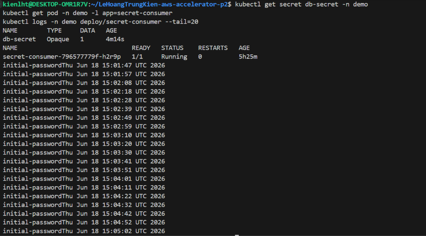

_ESO sync secret từ AWS Secrets Manager thành `db-secret`, app đọc được giá trị ban đầu._

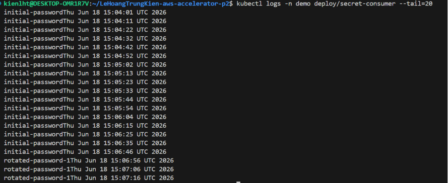

_Sau khi rotate secret trên AWS, Kubernetes Secret đổi theo và pod không cần restart._

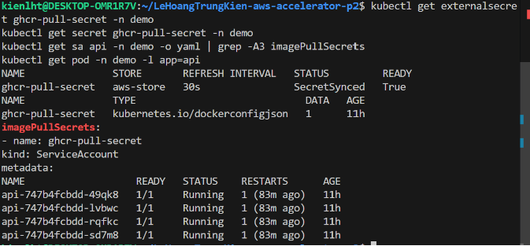

_ESO tạo `ghcr-pull-secret`; ServiceAccount `api` dùng secret này để pull private image._

## 4. Lab chiều - Trivy, Cosign, Sigstore

Kiểm tra image đã ký:

```bash
cosign verify \
  --key cloud/w10/temp/signing/cosign.pub \
  ghcr.io/x-brain-cdo-09/lehoangtrungkien-aws-accelerator-p2/w10-api:0.0.4
```

Kiểm tra policy controller:

```bash
kubectl get pod -n cosign-system
kubectl get endpoints webhook -n cosign-system
kubectl get clusterimagepolicy
kubectl describe clusterimagepolicy require-signed-w10-api
kubectl get ns demo payments --show-labels
```

Kiểm tra app pull image thành công:

```bash
kubectl get pod -n demo -l app=api
kubectl describe pod -n demo -l app=api | grep -E "Image:|Image ID:|Successfully pulled|Started" -A2
```

Kỳ vọng:

```text
cosign verify pass.
ClusterImagePolicy Ready=True.
Namespace demo/payments có label policy.sigstore.dev/include=true.
Pod api chạy image signed và Running.
```

Evidence:

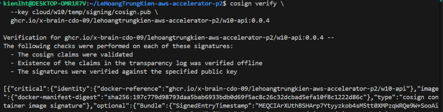

_`cosign verify` xác nhận image `w10-api:0.0.4` đã được ký đúng public key._

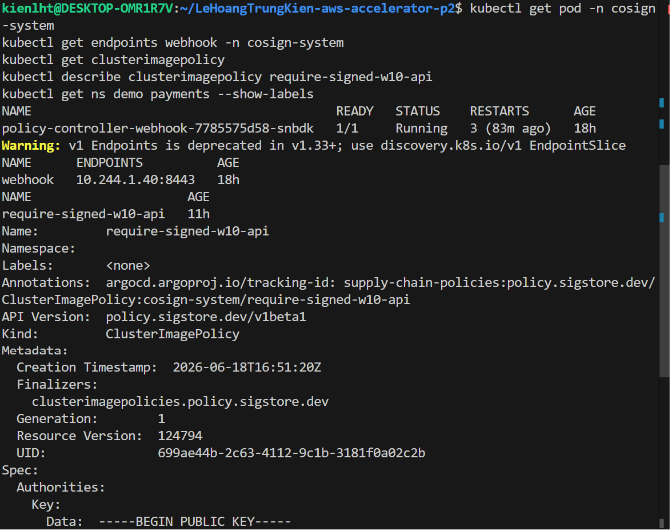

_Sigstore Policy Controller webhook chạy và sẵn sàng nhận admission request._

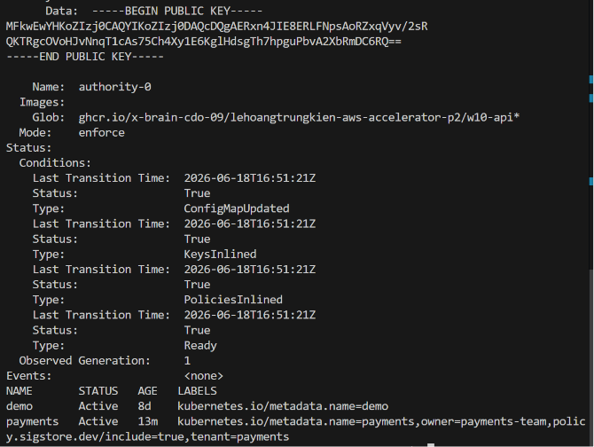

_ClusterImagePolicy Ready và namespace được label để bật kiểm tra chữ ký image._

## 5. Challenge - Payments Tenant RBAC

```bash
kubectl auth can-i create deploy -n payments \
  --as payments-dev

kubectl auth can-i create deploy -n demo \
  --as payments-dev

kubectl auth can-i get secrets -n payments \
  --as payments-dev

kubectl auth can-i update rolebindings -n payments \
  --as payments-dev
```

Kỳ vọng:

```text
create deploy -n payments       -> yes
create deploy -n demo           -> no
get secrets -n payments         -> no
update rolebindings -n payments -> no
```

Evidence:

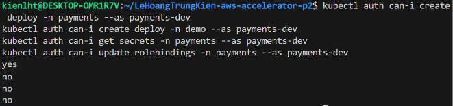

_`payments-dev` chỉ có quyền thao tác workload trong namespace `payments`, không leo quyền qua secrets hoặc rolebindings._

## 6. Challenge - Quota và LimitRange

```bash
kubectl get resourcequota,limitrange -n payments
kubectl apply -f cloud/w10/temp/evidence/payments/quota-violation.yaml
kubectl apply -f cloud/w10/temp/evidence/payments/limitrange-default-demo.yaml
kubectl get pod payments-limits-defaulted -n payments -o yaml | grep -A12 resources
```

Kỳ vọng:

```text
quota-violation bị reject vì vượt ResourceQuota.
limitrange-default-demo được tạo và container được default resources.
```

Evidence:

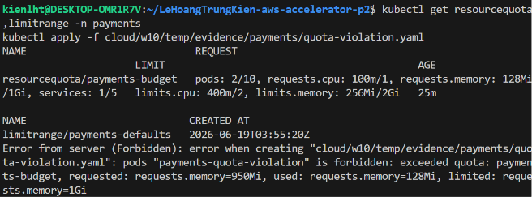

_ResourceQuota `payments-budget` reject pod vượt ngân sách tài nguyên của tenant._

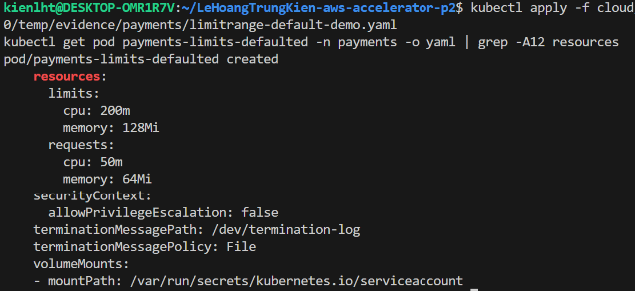

_LimitRange `payments-defaults` tự thêm requests/limits cho pod không khai báo resources._

Cleanup sau khi lấy evidence:

```bash
kubectl delete pod payments-limits-defaulted -n payments --ignore-not-found
```

## 7. Challenge - NetworkPolicy chặn gọi chéo

```bash
kubectl get networkpolicy -n payments
kubectl apply -f cloud/w10/temp/apps/payments/tests/violating-cross-namespace-curl.yaml
kubectl logs -n payments payments-curl-demo-api
```

Kỳ vọng:

```text
Pod payments-curl-demo-api không gọi được service ở namespace demo.
NetworkPolicy cần CNI có enforce policy, ví dụ Calico.
```

Evidence:

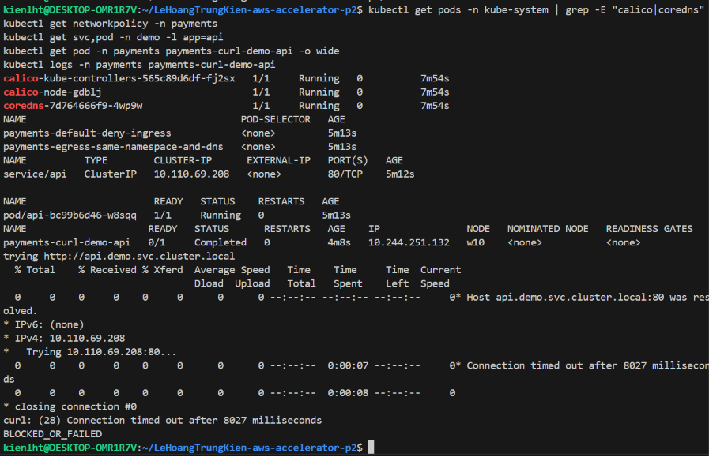

_Cluster `w10` có Calico Running; pod trong `payments` resolve được `api.demo.svc.cluster.local` nhưng kết nối timeout, chứng minh NetworkPolicy chặn egress gọi chéo namespace._

Cleanup sau khi lấy evidence:

```bash
kubectl delete pod payments-curl-demo-api -n payments --ignore-not-found
```

## 8. Challenge - App hợp lệ chạy, vi phạm bị constraint cũ chặn

Kiểm tra app hợp lệ:

```bash
kubectl get application payments payments-app -n argocd
kubectl get pod -n payments -l app=payments-api
kubectl describe pod -n payments -l app=payments-api | grep -E "Image:|Image ID:|Started|Successfully pulled" -A2
```

Test vi phạm policy cũ:

```bash
kubectl apply -f cloud/w10/temp/apps/payments/tests/violating-missing-owner.yaml
```

Kỳ vọng:

```text
payments-api Running.
Manifest thiếu owner bị Gatekeeper reject.
Điểm quan trọng: constraint cũ đã áp cho namespace payments, không chỉ demo.
```

Evidence:

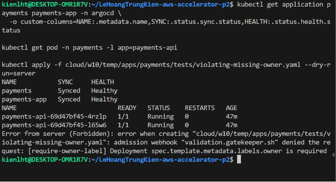

_App `payments-api` chạy hợp lệ, còn manifest thiếu `owner` bị constraint cũ chặn trong namespace `payments`._

## 9. Secret hygiene

```bash
git status --short
git grep -n -I -E 'AKIA|ASIA|github_pat_|ghp_|BEGIN .*PRIVATE KEY|AWS_SECRET_ACCESS_KEY' -- . ':!cloud/w10/temp/evidence/screenshots'
```

Kỳ vọng:

```text
Không có AWS access key, GitHub PAT, cosign private key hoặc secret thật bị commit.
Nếu có dòng chứa AWS_SECRET_ACCESS_KEY thì chỉ được là placeholder trong tài liệu hướng dẫn, không phải giá trị thật.
```

Evidence:

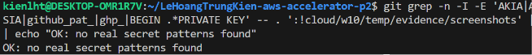

_Repo không chứa AWS key, GitHub PAT hoặc private key thật; các dòng còn lại chỉ là placeholder trong tài liệu._

## 10. Hai câu giải thích để nộp

```text
Payments được tách thành namespace riêng, RBAC chỉ cấp Role/RoleBinding trong namespace payments nên payments-dev không thể thao tác sang demo hoặc leo quyền bằng secrets/rolebindings. Guardrail cũ vẫn áp cho team mới vì Gatekeeper constraints đã mở rộng match namespace từ demo sang payments, còn Sigstore Policy Controller enforce theo label policy.sigstore.dev/include=true trên namespace payments.
```
