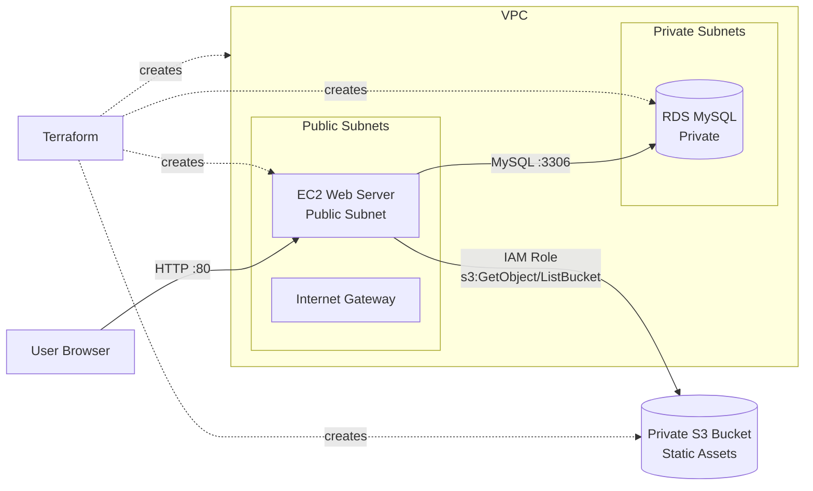

# AWS Web App Project

Project này dựng một web app đơn giản trên AWS bằng Terraform theo kiến trúc:

```text
VPC + Public/Private Subnets + EC2 + RDS MySQL + S3
```

Mục tiêu:

- EC2 web server nằm trong public subnet.
- RDS MySQL nằm trong private subnets, không public Internet.
- Static assets nằm trong S3 bucket private, encrypted.
- Security Groups chỉ mở traffic cần thiết.
- Hạ tầng được tách module rõ ràng để dễ đọc và tái sử dụng.

## Chạy Nhanh

Chạy từ folder này:

```bash
cd cloud/w8/aws-web-app
terraform init
terraform apply
```

Lấy URL web:

```bash
terraform output web_url
```

Dọn tài nguyên:

```bash
terraform destroy
```

## Kiến Trúc



## Luồng Deploy

Khi chạy `terraform apply`, Terraform làm các bước chính:

1. `module.network` tạo VPC, public subnets, private subnets, Internet Gateway, route tables.
2. `module.storage` tạo S3 bucket private, bật block public access, versioning, SSE, rồi upload `assets/index.html` và `assets/styles.css`.
3. `module.security` tạo Security Group cho web EC2 và RDS.
4. `module.database` tạo RDS MySQL trong private subnets bằng DB subnet group.
5. `module.compute` tạo EC2 trong public subnet, gắn IAM role đọc S3, rồi chạy `user_data`.

`user_data` trên EC2:

```text
install nginx + awscli
start nginx
aws s3 sync s3://<asset-bucket>/ /var/www/html/
write runtime.json with RDS endpoint metadata
reload nginx
health check localhost
```

## Luồng User Truy Cập

```text
User Browser
-> EC2 Public IP :80
-> nginx trên EC2
-> static files đã sync từ S3
-> response HTML/CSS trả về browser
```

RDS không public. Nếu app có backend thật, EC2 sẽ kết nối RDS qua private network:

```text
EC2 web security group
-> RDS security group :3306
-> RDS MySQL private endpoint
```

## Module Design

```text
root module
├── modules/network
├── modules/security
├── modules/storage
├── modules/compute
└── modules/database
```

### `modules/network`

Tạo:

- VPC.
- Public subnets.
- Private subnets.
- Internet Gateway.
- Public route table.
- Private route table.
- Optional NAT Gateway.

NAT Gateway mặc định tắt:

```hcl
enable_nat_gateway = false
```

Lý do: trong lab này private subnet chỉ chứa RDS, RDS không cần outbound Internet để chạy. NAT Gateway tốt cho production/private app server, nhưng tốn chi phí.

### `modules/storage`

Tạo S3 bucket cho static assets.

Best practices đang bật:

- Block public access.
- Bucket owner enforced.
- Versioning.
- Server-side encryption `AES256`.
- Lifecycle rule để abort multipart upload dang dở.

Bucket private, chỉ EC2 IAM role được đọc object cần thiết.

### `modules/security`

Tạo 2 Security Groups:

```text
web-sg
```

- Inbound HTTP `80` từ `allowed_http_cidr`.
- Optional SSH `22` khi `enable_ssh = true`.
- Outbound all để install package và tải asset từ S3.

```text
db-sg
```

- Inbound MySQL `3306` chỉ từ `web-sg`.
- Không mở RDS ra Internet.

### `modules/database`

Tạo RDS MySQL:

- DB subnet group dùng private subnets.
- `publicly_accessible = false`.
- Storage encrypted.
- Automated backup retention mặc định `7` ngày.
- Master password được RDS quản lý trong Secrets Manager qua `manage_master_user_password = true`.

Lab mặc định:

```hcl
db_deletion_protection = false
db_skip_final_snapshot = true
```

Production nên đổi thành:

```hcl
db_deletion_protection = true
db_skip_final_snapshot = false
db_multi_az = true
```

### `modules/compute`

Tạo EC2 web server trong public subnet:

- Ubuntu 22.04 AMI.
- Root volume encrypted `gp3`.
- IMDSv2 required.
- IAM instance profile đọc S3 bucket assets.
- `user_data` bootstrap nginx và sync static assets từ S3.

## Security Group Rules

| Source | Destination | Port | Purpose |
|---|---|---:|---|
| Internet / allowed CIDR | EC2 web SG | `80` | User truy cập web |
| SSH CIDR optional | EC2 web SG | `22` | Debug/admin khi cần |
| EC2 web SG | RDS SG | `3306` | Web server kết nối MySQL |
| EC2 IAM Role | S3 bucket | API | Download static assets |

## Vì Sao RDS Ở Private Subnet?

RDS là data layer nên không nên public. Web server là entry point public, còn database chỉ nhận traffic từ web server security group.

Flow an toàn hơn:

```text
Internet -> EC2 web
EC2 web -> RDS private
Internet -X-> RDS
```

## Vì Sao S3 Bucket Không Public?

S3 trong bài này đóng vai trò origin lưu static assets, không phải static website hosting public.

EC2 dùng IAM role để đọc assets:

```text
EC2 instance profile
-> IAM policy s3:ListBucket + s3:GetObject
-> private S3 bucket
```

Cách này tránh public bucket và giữ quyền theo least privilege.

## Biến Hay Dùng

Mở SSH tạm thời cho IP của bạn:

```bash
MY_IP=$(curl -s https://checkip.amazonaws.com)
terraform apply -var="enable_ssh=true" -var="ssh_cidr=${MY_IP}/32"
```

Bật NAT Gateway nếu private subnet cần outbound Internet:

```bash
terraform apply -var="enable_nat_gateway=true"
```

Bật cấu hình RDS gần production hơn:

```bash
terraform apply \
  -var="db_multi_az=true" \
  -var="db_deletion_protection=true" \
  -var="db_skip_final_snapshot=false"
```

## Verify

Kiểm tra web:

```bash
curl "$(terraform output -raw web_url)"
```

Kiểm tra asset trong S3:

```bash
aws s3 ls "s3://$(terraform output -raw s3_assets_bucket)/"
```

Nếu bật SSH:

```bash
ssh ubuntu@$(terraform output -raw ec2_public_ip)
sudo tail -n 100 /var/log/aws-web-app-bootstrap.log
curl http://127.0.0.1/
```

## Cost Notes

Để giữ chi phí lab thấp:

- NAT Gateway tắt mặc định.
- RDS Multi-AZ tắt mặc định.
- EC2 dùng `t3.micro`.
- RDS dùng `db.t3.micro`.
- RDS deletion protection tắt mặc định để destroy được.

Khi dùng production, nên xem lại các biến liên quan đến HA, backup, deletion protection và network egress.
