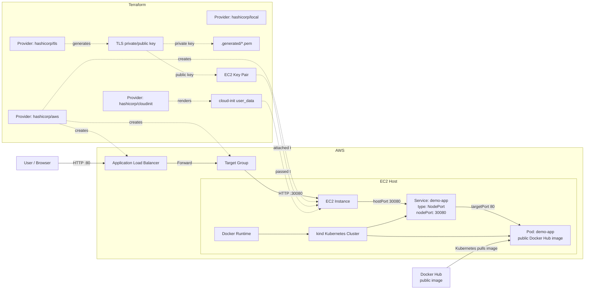

# K8s on AWS - Terraform 1-Click Lab

Lab này dựng một ứng dụng web nhỏ chạy trong Kubernetes trên AWS bằng Terraform.

Thiết kế hiện tại dùng **public Docker Hub image đã build sẵn**, nên người khác clone repo về có thể chạy Terraform mà **không cần bật Docker local**.

Flow chính:

```text
Terraform apply
-> tạo AWS infrastructure
-> EC2 boot bằng cloud-init user_data
-> EC2 tạo kind Kubernetes cluster
-> Kubernetes pull public image từ Docker Hub
-> ALB expose app ra Internet
```

## Chạy Nhanh

Yêu cầu trên máy local:

- Terraform.
- AWS credentials hợp lệ.
- Quyền AWS để tạo VPC, EC2, ALB, Security Group, Key Pair.
- Internet để Terraform tải providers và EC2 tải package/kind/kubectl.

Không cần Docker local nếu dùng image public đã push sẵn lên Docker Hub.

Chạy từ folder `cloud/w8/lab`:

```bash
terraform init && terraform apply -auto-approve
```

Lấy URL:

```bash
terraform output alb_url
```

Destroy:

```bash
terraform destroy -auto-approve
```

## Image App

App image được cấu hình bằng biến:

```hcl
app_image = "docker.io/kienlht/k8s-demo-app:v1"
```

Ý nghĩa:

- Image này đã được build và push lên Docker Hub public trước.
- Terraform không build image nữa.
- EC2 không build image.
- Kubernetes pull image trực tiếp từ Docker Hub.
- Vì image public nên không cần `imagePullSecret`.

Nếu đổi Docker Hub username hoặc tag, sửa:

```hcl
app_image = "docker.io/<dockerhub-user>/k8s-demo-app:v1"
```

### Build Image Một Lần Duy Nhất

Chỉ người maintain lab cần làm bước này một lần:

```bash
cd cloud/w8/lab
docker build -t docker.io/<dockerhub-user>/k8s-demo-app:v1 ./demo-app
docker login
docker push docker.io/<dockerhub-user>/k8s-demo-app:v1
```

Sau khi image public tồn tại trên Docker Hub, người khác clone repo chỉ cần chạy Terraform.

## Sơ Đồ Kiến Trúc



## Luồng Terraform Deploy

Khi chạy:

```bash
terraform init && terraform apply -auto-approve
```

Terraform dựng dependency graph. Các resource không phụ thuộc nhau có thể chạy song song, nhưng về mặt logic flow là:

### 1. `terraform init`

Chạy ở local.

Đọc `versions.tf` và `.terraform.lock.hcl` để tải providers:

```text
hashicorp/aws
hashicorp/tls
hashicorp/local
hashicorp/cloudinit
```

`.terraform.lock.hcl` giữ provider version ổn định để người khác clone repo có kết quả reproducible hơn.

### 2. `tls_private_key.ec2`

Chạy ở Terraform local state, dùng provider `hashicorp/tls`.

Tạo một SSH key pair:

```text
private key + public key
```

Hai key này không giống nhau, nhưng là một cặp khớp nhau:

- Private key: giữ ở máy local để SSH vào EC2 nếu cần.
- Public key: import lên AWS để EC2 cho phép private key đó login.

### 3. `local_sensitive_file.generated_private_key`

Chạy ở local, dùng provider `hashicorp/local`.

Ghi private key ra:

```text
.generated/<name>.pem
```

với permission:

```text
0600
```

File `.generated/` bị ignore bởi root `.gitignore`, không commit lên repo.

### 4. `aws_key_pair.generated`

Chạy trên AWS, dùng provider `hashicorp/aws`.

Import public key lên AWS:

```text
tls_private_key.ec2.public_key_openssh
-> aws_key_pair.generated.public_key
```

EC2 được tạo với:

```hcl
key_name = local.key_name
```

Nhờ vậy nếu bật SSH, người chạy lab có thể dùng private key local để login EC2.

### 5. `module.network`

Chạy trên AWS.

Tạo nền mạng:

```text
VPC 10.42.0.0/16
2 public subnets
Internet Gateway
Public Route Table
Route Table Associations
```

Vì ALB là internet-facing nên cần public subnet. EC2 cũng nằm public subnet để dễ tải package và debug nếu cần.

Route chính:

```text
0.0.0.0/0 -> Internet Gateway
```

### 6. `module.security`

Chạy trên AWS.

Tạo 2 Security Groups.

ALB Security Group:

```text
Inbound: TCP 80 from 0.0.0.0/0
Outbound: all traffic
```

EC2 Security Group:

```text
Inbound: TCP 30080 from ALB Security Group
Outbound: all traffic
```

Ý nghĩa:

- User chỉ truy cập public qua ALB port `80`.
- EC2 app port `30080` không mở trực tiếp cho toàn Internet.
- EC2 chỉ nhận app traffic từ ALB.

### 7. `module.compute`

Chạy trên AWS và dùng `hashicorp/cloudinit` để render user data.

Module này:

```text
Tìm Ubuntu AMI mới nhất
Render user_data.sh.tftpl bằng cloudinit
Tạo EC2 instance
Gắn security group
Gắn key pair
Truyền user_data vào EC2
```

Khi EC2 boot lần đầu, Ubuntu `cloud-init` chạy script user data. Script sẽ:

```text
cài Docker
tạo swap
cài kubectl
cài kind
tạo kind cluster
deploy Deployment + Service NodePort
đợi rollout demo-app hoàn tất
```

### 8. `module.alb`

Chạy trên AWS.

Tạo:

```text
Application Load Balancer
Target Group
HTTP Listener :80
Target Group Attachment
```

Target Group dùng:

```text
target_type = instance
port        = 30080
```

Nghĩa là ALB attach EC2 bằng instance ID và forward request vào EC2 port `30080`.

## Provider `cloudinit` Là Gì

Cần tách 2 khái niệm:

- `cloud-init`: service có sẵn trên Ubuntu EC2, chạy lúc máy boot để xử lý `user_data`.
- `hashicorp/cloudinit`: Terraform provider dùng để render/đóng gói `user_data` trước khi gửi cho EC2.

Provider `cloudinit` không SSH vào EC2 và không tự chạy script. Nó chỉ tạo ra chuỗi user data hoàn chỉnh ở phía Terraform.

Flow:

```text
Terraform variables
-> templatefile(user_data.sh.tftpl)
-> cloudinit_config.bootstrap.rendered
-> aws_instance.user_data
-> EC2 boots
-> Ubuntu cloud-init service runs bootstrap-kind.sh
```

Trong `modules/compute/main.tf`:

```hcl
data "cloudinit_config" "bootstrap" {
  gzip          = false
  base64_encode = false

  part {
    content_type = "text/x-shellscript"
    filename     = "bootstrap-kind.sh"
    content = templatefile(var.user_data_template, {
      app_image     = var.app_image
      app_node_port = var.app_node_port
    })
  }
}
```

Sau đó EC2 dùng:

```hcl
user_data = data.cloudinit_config.bootstrap.rendered
```

Ý nghĩa:

- `content_type = "text/x-shellscript"`: nói với EC2 cloud-init rằng đây là shell script.
- `filename = "bootstrap-kind.sh"`: tên logic của script trong cloud-init payload.
- `templatefile(...)`: thay biến Terraform vào script.
- `rendered`: kết quả cuối cùng đưa vào `aws_instance.user_data`.

## User Data Làm Gì

File:

```text
user_data.sh.tftpl
```

Khi EC2 boot, script này chạy trên EC2.

Các bước chính:

### 1. Ghi log bootstrap

```bash
exec > >(tee /var/log/k8s-lab-bootstrap.log) 2>&1
```

Log nằm ở:

```text
/var/log/k8s-lab-bootstrap.log
```

### 2. Cài package

```bash
apt-get update
apt-get install -y ca-certificates curl apt-transport-https docker.io
```

Cài Docker và các tool cần để tải kubectl/kind.

### 3. Tạo swap

```bash
fallocate -l 2G /swapfile
chmod 600 /swapfile
mkswap /swapfile
swapon /swapfile
```

EC2 nhỏ có thể thiếu RAM khi chạy Docker + kind, nên swap giúp bootstrap ổn hơn.

### 4. Cài kubectl và kind

```bash
curl -fsSL -o /usr/local/bin/kubectl ...
curl -fsSL -o /usr/local/bin/kind ...
```

- `kubectl`: CLI nói chuyện với Kubernetes cluster.
- `kind`: công cụ tạo Kubernetes cluster chạy trong Docker.

### 5. Tạo kind cluster với port mapping

```yaml
extraPortMappings:
  - containerPort: 30080
    hostPort: 30080
    listenAddress: "0.0.0.0"
    protocol: TCP
```

Ý nghĩa:

```text
EC2 host port 30080
-> kind node container port 30080
-> Kubernetes Service nodePort 30080
```

### 6. Tạo Deployment và Service

Script tạo `/tmp/demo-app.yaml` gồm:

- `Deployment demo-app`.
- `Service demo-app type NodePort`.
- readiness/liveness probes.

Deployment dùng image:

```yaml
image: ${app_image}
```

Vì image public trên Docker Hub nên không cần `imagePullSecret`.

### 7. Apply app

```bash
kubectl apply -f /tmp/demo-app.yaml
kubectl rollout status deployment/demo-app --timeout=180s
```

Đây là bước đưa app vào Kubernetes cluster.

## Luồng User Truy Cập Hệ Thống

Sau khi apply xong, Terraform output:

```bash
terraform output alb_url
```

Luồng request:

```text
Browser
-> ALB DNS :80
-> Target Group
-> EC2 private IP :30080
-> EC2 hostPort :30080
-> kind nodePort :30080
-> Kubernetes Service port :80
-> Pod targetPort/containerPort :80
```

Chi tiết:

1. User mở URL ALB.
2. ALB nhận request ở port `80`.
3. Listener forward request vào Target Group.
4. Target Group attach EC2 instance và gọi EC2 port `30080`.
5. EC2 Security Group cho phép `30080` chỉ từ ALB Security Group.
6. `kind extraPortMappings` đưa EC2 host port `30080` vào kind node.
7. Kubernetes Service NodePort nhận request ở `nodePort: 30080`.
8. Service route tới Pod có label `app: demo-app`.
9. Container nginx trong Pod trả HTML/CSS ở port `80`.

## Port Matching

Một biến duy nhất điều khiển đường port:

```hcl
app_node_port = 30080
```

Biến này được dùng ở:

- ALB Target Group port.
- EC2 Security Group ingress.
- `kind extraPortMappings`.
- Kubernetes Service `nodePort`.

| Lớp | Port | Ai dùng | Ý nghĩa |
|---|---:|---|---|
| ALB Listener | `80` | User/browser | Port public để user truy cập |
| Target Group | `30080` | ALB | Port ALB gọi vào EC2 |
| EC2 hostPort | `30080` | kind port mapping | Port mở trên EC2 host |
| Kubernetes nodePort | `30080` | Kubernetes Service | Port mở trên Kubernetes node |
| Service port | `80` | Bên trong cluster | Port ổn định của Service |
| Pod targetPort | `80` | Service route tới Pod | Port nginx container lắng nghe |

## Kubernetes Concepts

### Cluster

Cluster là môi trường Kubernetes. Trong lab này, cluster chạy bằng `kind` trên EC2.

```text
EC2
-> Docker
-> kind cluster
```

### Deployment

Deployment mô tả app cần chạy:

```yaml
kind: Deployment
spec:
  replicas: 2
```

Nó tạo và duy trì Pod. Nếu Pod chết, Deployment tạo Pod mới.

### Pod

Pod là đơn vị chạy nhỏ nhất trong Kubernetes. Trong lab này Pod chứa container nginx chạy image từ Docker Hub.

### Service

Service tạo endpoint ổn định để route traffic tới Pod.

Trong lab:

```yaml
kind: Service
spec:
  type: NodePort
  ports:
    - port: 80
      targetPort: 80
      nodePort: 30080
```

Ý nghĩa:

- `nodePort: 30080`: cửa từ ngoài cluster vào Kubernetes node.
- `port: 80`: port của Service bên trong cluster.
- `targetPort: 80`: port thật trên container trong Pod.

Service tìm Pod bằng selector:

```yaml
selector:
  app: demo-app
```

Pod do Deployment tạo có label:

```yaml
labels:
  app: demo-app
```

Selector và label khớp nhau nên Service route đúng tới Pod của app.

## kind Và Minikube

`kind` là Kubernetes IN Docker. Nó chạy Kubernetes node như Docker container.

Lý do dùng `kind`:

- Chạy được trên một EC2.
- Có `extraPortMappings` rõ ràng.
- Phù hợp với ALB forward vào EC2 port cố định.

`minikube` cũng chạy Kubernetes single-node, nhưng expose NodePort ra host EC2 có thể phụ thuộc driver/networking và dễ cần thêm tunnel/port-forward. Với bài ALB -> EC2 fixed port, `kind` gọn hơn.

## Vì Sao Không Dùng ECR Trong Flow Mới

Ban đầu flow dùng:

```text
local Docker build -> ECR -> Kubernetes pull image
```

Nhược điểm: người clone repo phải có Docker local đang chạy.

Flow mới dùng:

```text
Docker Hub public image đã push sẵn
-> Terraform apply
-> Kubernetes pull image public
```

Ưu điểm:

- Người clone repo không cần Docker local.
- Không cần ECR repository.
- Không cần IAM role để EC2 đọc ECR.
- Không cần imagePullSecret.
- Terraform apply đơn giản hơn.

Đổi lại, image phải được build/push lên Docker Hub public trước.

## Vì Sao Không Dùng Kubernetes Provider

Cluster kind được tạo trong EC2 `user_data`, nghĩa là lúc Terraform bắt đầu apply thì Kubernetes API chưa tồn tại.

Nếu dùng Kubernetes provider, Terraform cần kubeconfig/API endpoint trước. Điều này dễ làm apply fail hoặc phải tách 2 phase.

Thiết kế hiện tại:

```text
Terraform quản AWS infra
EC2 user_data tạo cluster và kubectl apply app
```

Cách này ổn định hơn cho mục tiêu `1-click apply`.

## Modules

- `modules/network`: VPC, subnets, internet gateway, route table.
- `modules/security`: Security Groups cho ALB và EC2.
- `modules/compute`: EC2, cloud-init user data, kind bootstrap.
- `modules/alb`: ALB, Target Group, Listener, Target Attachment.

## Verify

Mở app:

```bash
terraform output alb_url
```

Debug bootstrap:

```bash
sudo tail -n 100 /var/log/k8s-lab-bootstrap.log
```

Kiểm tra Kubernetes trên EC2:

```bash
kubectl get nodes
kubectl get pods
kubectl get deploy
kubectl get svc
```

Output mong muốn:

```text
deployment/demo-app   READY
pod/demo-app-...      Running
service/demo-app      NodePort      80:30080/TCP
```

## Evidence

Xem:

```text
evidence.md
```

File này chứa screenshot apply, browser mở ALB URL, checklist acceptance và destroy.

## Tóm Tắt Trình Bày

Terraform dùng `aws provider` để dựng VPC, EC2, ALB, Target Group và Security Group. `tls provider` tạo SSH key pair, `local provider` ghi private key ra file local, và `cloudinit provider` render bootstrap script thành EC2 user data. App image đã được build/push sẵn lên Docker Hub public, nên Terraform không cần Docker local và không cần ECR. Khi EC2 boot, user data cài Docker, kubectl, kind, tạo Kubernetes cluster, rồi `kubectl apply` Deployment và Service NodePort. User truy cập qua ALB public, ALB forward vào EC2 port `30080`, kind map port đó vào Kubernetes Service, và Service route traffic tới Pod chạy app.
