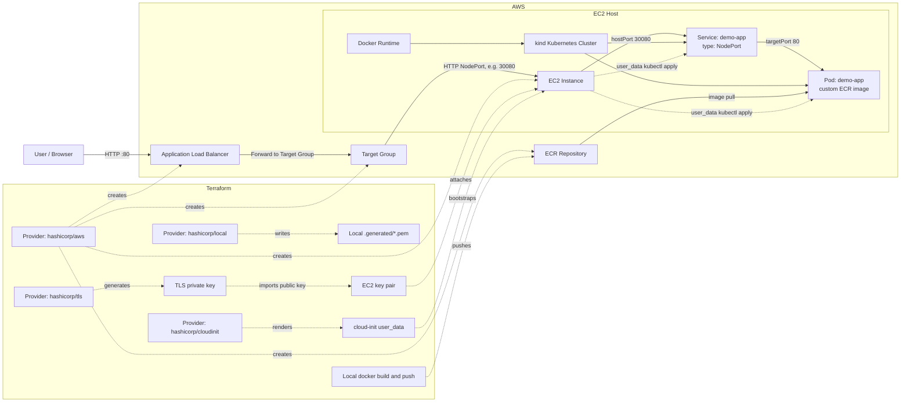
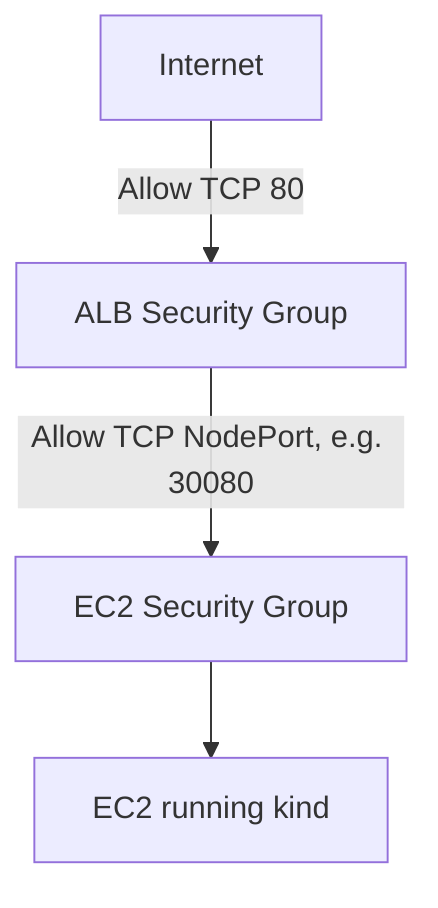

# Part 2 - Slide 32+ Challenge README

Tài liệu này tóm tắt phần từ `slide 32` trở đi trong `k8s-part2-in-practice (1).html` và chuyển nó thành checklist làm bài theo từng bước.

## Đề Bài Tóm Tắt

Mục tiêu là làm một bài `K8s on AWS - Terraform 1-Click` với các yêu cầu:

- Dựng `1 EC2` bằng Terraform.
- Chạy `minikube` hoặc `kind` trên EC2 đó.
- Deploy một app nhỏ nhẹ vào Kubernetes.
- Expose app ra Internet qua `ALB`.
- Toàn bộ quá trình phải có thể dựng bằng `1 lệnh`.
- Phải dùng `>= 2 Terraform providers`.

## Hiểu Đúng Trước Khi Bắt Đầu

Đây là đề bài thiết kế và triển khai, không phải bài copy YAML theo mẫu.

Bạn cần tự quyết định:

- Dùng `minikube` hay `kind`.
- Dùng app nào.
- Dùng provider thứ hai là gì.
- Dùng `user_data`, `remote-exec`, hay cách nào để bootstrapping EC2.
- Cách đưa manifest/app vào cụm.
- Cách nối `ALB` vào app đang chạy trong Kubernetes.

## Kết Quả Cuối Cùng Cần Có

Khi xong bài, bạn phải có:

- Repo Terraform đầy đủ.
- `README.md` mô tả cách chạy, kiến trúc, và cách wire providers.
- URL của `ALB` mở được app trên browser.
- Có thể `terraform destroy` sạch sau khi test.

Acceptance criteria:

- Chạy `1 lệnh` từ repo sạch là dựng được toàn bộ.
- App thực sự chạy trong Kubernetes, không chạy trực tiếp trên EC2.
- Có ít nhất `2 providers` trong cùng cấu hình Terraform.
- Có thể giải thích vì sao chọn kiến trúc đó.
- Có thể dựng lại nhiều lần cho cùng kết quả.

## Kiến Trúc Đề Xuất

Nên dùng hướng sau cho bài lab này:

- Kubernetes distro: `kind`
- Bootstrapping EC2: `user_data`
- App demo: static UI trong `demo-app`, chạy bằng `nginx:1.27-alpine`
- Providers: `hashicorp/aws`, `hashicorp/tls`, `hashicorp/local`, `hashicorp/cloudinit`
- Expose app: `Service type NodePort`
- ALB target: `EC2:<NodePort>`, ví dụ `EC2:30080`
- Network flow: `Internet -> ALB -> EC2:NodePort -> Kubernetes Service -> Pod`
- Image flow: `Local Docker build -> ECR -> Kubernetes pulls image`

Lý do chọn hướng này:

- `kind` phù hợp với ALB hơn trong bài này vì có thể map rõ `hostPort 30080` trên EC2 vào `NodePort 30080` trong cluster.
- `user_data` giúp EC2 tự cài Docker, kubectl, kind và tự bootstrap cluster khi được tạo.
- App static trong `demo-app` có giao diện riêng, nhẹ, dễ kiểm tra bằng browser.
- `tls provider` tạo SSH key pair cho EC2.
- `local provider` ghi private key sinh ra vào file local `.generated/*.pem` với permission `0600`.
- `cloudinit provider` render script bootstrap thành cloud-init user data cho EC2.
- `NodePort` là cách đơn giản nhất để ALB bên ngoài forward traffic vào app chạy trong Kubernetes trên EC2.
- Image được build ở local và push lên ECR trước, EC2 không cần build image.
- Deploy Kubernetes app bằng `kubectl apply` trong `user_data` đáng tin cậy hơn vì kubeconfig và Kubernetes API chỉ sẵn sàng sau khi EC2 bootstrap xong.



Security group flow:



Câu giải thích ngắn:

> Terraform dùng `aws provider` để tạo ECR, EC2, ALB, target group, listener và security group. `tls provider` tạo SSH key pair cho EC2, `local provider` ghi private key ra file local `.generated/*.pem`, và `cloudinit provider` render script bootstrap thành EC2 user data. Trong lúc `terraform apply`, máy local build image từ `demo-app` rồi push lên ECR. EC2 chạy `kind` thông qua user data, sau đó chính user data dùng `kubectl apply` để tạo `Deployment` và `Service type NodePort`. ALB public nhận request từ Internet rồi forward vào NodePort trên EC2, sau đó Kubernetes Service chuyển traffic tới Pod app.

## Hướng Khuyên Dùng

Với lựa chọn hiện tại của bạn, hướng dễ làm nhất là:

- Kubernetes distro: `kind`
- Bootstrapping: `user_data`
- App demo: static UI trong `demo-app`
- Providers: `hashicorp/aws`, `hashicorp/tls`, `hashicorp/local`, `hashicorp/cloudinit`
- Expose từ K8s ra ngoài: `Service type NodePort`
- Flow network: `Internet -> ALB -> EC2:NodePort -> Service -> Pod`
- Flow image: `Local Docker build -> ECR -> Kubernetes pulls image`

Lý do:

- `kind` dễ map port từ Kubernetes node ra host EC2, phù hợp với ALB target group.
- `user_data` giúp máy EC2 tự cài Docker, kubectl, kind ngay khi boot.
- App static nhẹ, có giao diện riêng, dễ kiểm tra bằng browser.
- Các provider phụ trợ `tls`, `local`, `cloudinit` giúp tạo key pair, lưu key local và render user data một cách rõ ràng.
- `NodePort` là cách đơn giản nhất để nối `ALB` với app chạy trong Kubernetes trên một EC2.

## Cách Chạy Terraform

Yêu cầu trên máy local:

- Terraform
- Docker
- AWS CLI đã đăng nhập đúng account
- AWS credentials có quyền tạo VPC, EC2, ALB, IAM, ECR

Nếu chạy trong WSL2, Docker Desktop phải bật integration cho distro hiện tại:

```text
Docker Desktop -> Settings -> Resources -> WSL integration
```

Chạy từ folder `lab`:

```bash
terraform init && terraform apply -auto-approve
```

Mặc định lab dùng `instance_type = "t3.micro"` để phù hợp account bị giới hạn Free Tier. Nếu account không bị giới hạn và muốn `kind` chạy thoải mái hơn, có thể đổi sang `t3.medium` trong `terraform.tfvars`.

Terraform sẽ:

1. Chạy preflight check cho AWS CLI, Docker CLI, Docker daemon và folder `demo-app`.
2. Tạo ECR repository.
3. Build image từ `demo-app` ở máy local.
4. Push image lên ECR.
5. Tạo VPC, EC2, ALB, target group và security group.
6. EC2 tự cài Docker, kubectl, kind.
7. EC2 tạo Kubernetes cluster và deploy app từ ECR.
8. Output `alb_url` để mở app trên browser.

Terraform modules:

- `modules/network`: VPC, public subnets, route table, internet gateway.
- `modules/ecr`: ECR repository cho image của demo app.
- `modules/image-build`: local Docker build và push image lên ECR.
- `modules/security`: security group cho ALB và EC2.
- `modules/compute`: EC2, IAM role/profile, `user_data` bootstrap kind.
- `modules/alb`: ALB, target group, listener, target attachment.

Port matching:

- Terraform không cần đọc Service port từ Kubernetes sau khi cluster tạo xong.
- Biến `app_node_port` được cố định mặc định là `30080`, nằm trong dải NodePort hợp lệ `30000-32767`.
- `modules/alb` dùng `app_node_port` làm target group port.
- `modules/security` mở đúng `app_node_port` từ ALB vào EC2.
- `user_data` dùng cùng `app_node_port` để cấu hình `kind extraPortMappings`.
- Kubernetes Service cũng dùng cùng `app_node_port` trong field `nodePort`.

Vì tất cả layer dùng chung một biến nên flow luôn khớp:

```text
ALB :80 -> EC2 :30080 -> kind hostPort :30080 -> Service nodePort :30080 -> Pod :80
```

Verify:

```bash
terraform output alb_url
```

Mở URL đó trên browser. ALB có thể cần vài phút để health check chuyển sang healthy sau khi EC2 bootstrap xong.

Destroy:

```bash
terraform destroy -auto-approve
```

## Step By Step

### Bước 1 - Chốt thiết kế mức cao

Trước khi code, tự trả lời 5 câu hỏi này:

1. Bạn sẽ dùng `minikube` hay `kind`?
2. App demo là gì?
3. `ALB` sẽ forward vào đâu trên EC2?
4. Provider thứ hai trong Terraform là gì?
5. Lệnh `1-click` cuối cùng sẽ là gì?

Output mong muốn:

- Có một sơ đồ đơn giản như:

`Internet -> ALB -> EC2 -> kind -> Service -> Pod`

### Bước 2 - Chọn app demo nhỏ và dễ kiểm tra

Nên chọn app:

- nhẹ,
- mở HTTP đơn giản,
- dễ biết là nó đang chạy thành công.

Ví dụ phù hợp:

- `nginx`
- `hashicorp/http-echo`
- app web rất nhỏ tự viết

Khuyến nghị hiện tại:

- dùng static UI trong `demo-app`, đóng gói bằng `nginx:1.27-alpine`

Output mong muốn:

- Biết image nào sẽ deploy vào cluster.
- Biết app nghe ở port nào.

### Bước 3 - Chọn cách expose app từ cluster ra host EC2

Bạn cần giải bài toán:

- App chạy trong Kubernetes.
- `ALB` ở AWS phải forward được request vào app đó.

Câu hỏi cần nghiên cứu:

- Với `kind` trên 1 EC2, traffic từ host EC2 vào Pod sẽ đi kiểu gì?
- Có dùng `NodePort`, `Ingress`, hay port mapping riêng?

Hướng đơn giản thường dễ làm hơn:

- app chạy qua `Deployment`
- expose bằng `Service type NodePort`
- `ALB target group` forward vào `EC2:NodePort`

Output mong muốn:

- Chốt được đường đi của request từ `ALB` tới app.

### Bước 4 - Thiết kế hạ tầng AWS tối thiểu

Xác định các resource AWS cần có:

- `VPC` hoặc dùng default VPC
- `subnets`
- `security group`
- `EC2`
- `ALB`
- `target group`
- `listener`

Lưu ý:

- Security group của EC2 phải cho phép traffic từ ALB vào cổng app/NodePort.
- Security group của ALB phải mở `80` hoặc `443` từ Internet.

Output mong muốn:

- Có danh sách resource rõ ràng trước khi viết Terraform.

### Bước 5 - Chọn provider thứ hai

Yêu cầu bài là phải dùng `>= 2 providers`.

Provider đầu tiên gần như chắc chắn là:

- `hashicorp/aws`

Provider thứ hai có thể là một trong các hướng:

- `hashicorp/tls`
- `hashicorp/kubernetes`
- `hashicorp/helm`

Gợi ý hợp lý nhất cho bài này:

- dùng `aws` để dựng hạ tầng
- dùng `tls` để tạo SSH key pair cho EC2
- deploy app vào cluster bằng `kubectl apply` trong `user_data`

Không khuyến nghị dùng `kubernetes provider` làm hướng chính cho bài này nếu mục tiêu là `1-click apply`, vì cluster kind và kubeconfig chỉ xuất hiện sau khi EC2 bootstrap xong.

Output mong muốn:

- Chốt được cặp provider sẽ dùng.
- Biết provider thứ hai sẽ kết nối vào cluster bằng cách nào.

### Bước 6 - Viết Terraform dựng EC2 trước

Làm hạ tầng tối thiểu trước khi nghĩ tới app:

1. Tạo `EC2`.
2. Gắn `security group`.
3. Đảm bảo SSH hoặc cơ chế bootstrap hoạt động.
4. Dùng `user_data` để cài:
   - Docker
   - kubectl
   - kind

Output mong muốn:

- `terraform apply` xong thì EC2 lên được.
- SSH vào máy thấy Docker và Kubernetes tool đã sẵn sàng.

### Bước 7 - Bootstrapping cluster trên EC2

Sau khi EC2 lên, bạn cần làm cho cluster thật sự chạy:

1. Start `kind`.
2. Kiểm tra `kubectl get nodes`.
3. Đảm bảo cluster sẵn sàng trước khi deploy app.

Với hướng bạn chọn:

- bootstrap trong `user_data`

Output mong muốn:

- EC2 có cluster Kubernetes hoạt động ổn định.

### Bước 8 - Deploy app vào Kubernetes

Sau khi cluster lên:

1. Tạo `Deployment`.
2. Tạo `Service`.
3. Nếu cần thì thêm `ConfigMap`, `Secret`, `probes`.

Với hướng `1-click`, bước này nên chạy trong `user_data` bằng `kubectl apply` sau khi cluster kind đã `Ready`.

Output mong muốn:

- `kubectl get deploy,svc,pods` trên EC2 đều healthy.

### Bước 9 - Expose app để ALB gọi được

Đây là bước quan trọng nhất của challenge.

Bạn cần:

1. Chọn port ngoài mà ALB sẽ gọi vào.
2. Map traffic từ ALB tới EC2.
3. Từ EC2 chuyển tiếp tới app trong cluster.

Nếu dùng `NodePort`, cần:

- biết NodePort cụ thể,
- mở đúng port trong security group,
- target group của ALB trỏ đúng port đó.

Output mong muốn:

- Từ browser mở `ALB DNS name` thấy app trả response.

### Bước 10 - Làm cho mọi thứ chạy bằng 1 lệnh

Mục tiêu của bài là `1-click automation`.

Bạn cần chốt:

- lệnh duy nhất người chấm sẽ chạy là gì

Ví dụ hướng thường gặp:

```bash
terraform init
terraform apply -auto-approve
```

Nếu trainer yêu cầu thật sự chỉ một câu lệnh, README của bạn phải ghi rất rõ.

Output mong muốn:

- Người khác clone repo và chạy theo README là lên được app.

### Bước 11 - Viết README nộp bài

README nên có các phần:

- mục tiêu bài
- sơ đồ kiến trúc
- providers dùng là gì
- lệnh chạy
- app được deploy ra sao
- ALB đi vào K8s theo đường nào
- cách verify
- cách destroy

Output mong muốn:

- Trainer đọc README là hiểu kiến trúc và biết cách chấm bài.

### Bước 12 - Chuẩn bị phần giải thích miệng

Trainer có thể hỏi:

- Vì sao dùng `kind` thay vì `minikube`?
- Vì sao chọn `NodePort`?
- Provider thứ hai được wire như thế nào?
- Terraform biết thứ tự tạo hạ tầng rồi mới deploy app ra sao?
- Vì sao giải pháp của bạn có thể reproducible?

Output mong muốn:

- Bạn giải thích được kiến trúc, không chỉ chạy được code.

## Thứ Tự Làm Khuyên Dùng

Đừng làm tất cả cùng lúc. Làm theo thứ tự này:

1. Chốt kiến trúc.
2. Dựng EC2 chạy được.
3. Bootstrapping được kind.
4. Deploy được app vào cluster.
5. Expose app nội bộ từ cluster ra host.
6. Gắn ALB vào đường đi đó.
7. Tích hợp provider thứ hai vào Terraform.
8. Chuẩn hóa thành `1-click`.
9. Viết README và bằng chứng.

## Những Chỗ Dễ Kẹt

- Cluster lên chậm hơn Terraform mong đợi.
- Nếu dùng `kubernetes provider`, provider có thể kết nối khi cluster chưa ready.
- `ALB` không gọi được app vì sai `NodePort` hoặc security group.
- App chạy trong cluster nhưng chỉ truy cập được từ localhost trên EC2.
- Dùng `kind` nhưng chưa map đúng hostPort ra EC2.

Khi kẹt, debug theo lớp:

1. AWS đã dựng đủ resource chưa?
2. EC2 đã cài xong Docker/K8s tool chưa?
3. Cluster đã `Ready` chưa?
4. Deployment/Service trong cluster đã healthy chưa?
5. Từ EC2 gọi local vào app được chưa?
6. Từ ALB gọi vào EC2 được chưa?

## Câu Chốt Để Nhớ

Phần từ `slide 32` trở đi không còn là học object rời rạc nữa. Nó chuyển sang một challenge tích hợp:

- `Terraform` dựng hạ tầng,
- `AWS` cấp EC2 + ALB,
- `Kubernetes` chạy app,
- và bạn phải nối tất cả lại thành một flow có thể chạy bằng `1 lệnh`.
