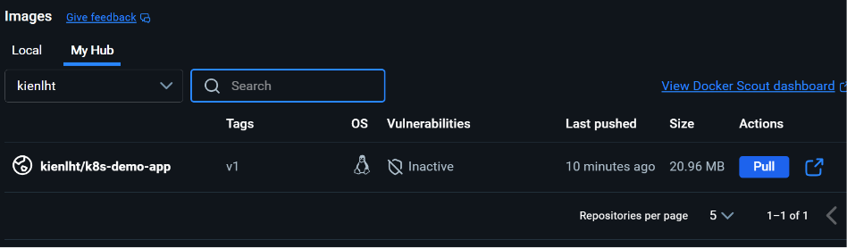
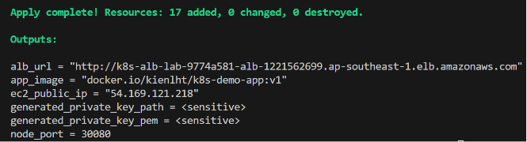
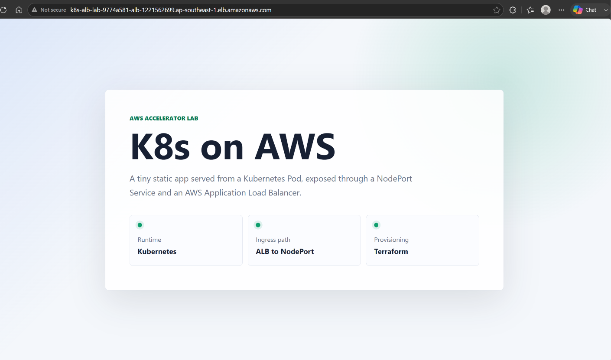
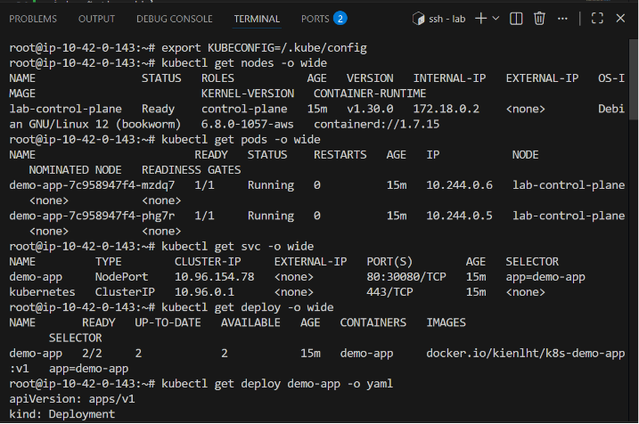
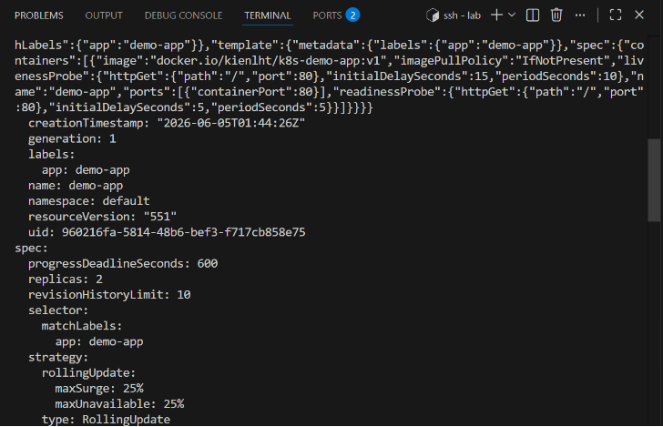
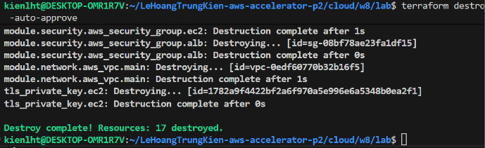

# Evidence - K8s on AWS Terraform 1-Click

## Nộp Gì

Deliverables:

- Repo Terraform đầy đủ trong folder `lab`.
- `README.md` có:
  - lệnh chạy,
  - sơ đồ kiến trúc,
  - giải thích cách wire providers,
  - cách verify,
  - cách destroy.
- Bằng chứng app chạy qua ALB:
  - URL ALB mở được trên browser,
  - ảnh chụp màn hình hoặc clip ngắn.
- Bằng chứng destroy sạch sau khi test.

## Lệnh Chạy

Chạy từ folder `lab`:

```bash
terraform init && terraform apply -auto-approve
```

Lấy URL ALB:

```bash
terraform output alb_url
```

Destroy:

```bash
terraform destroy -auto-approve
```

## Bằng Chứng Cần Chụp

### 1. Docker Hub Public Image Đã Sẵn Sàng

Image:

```text
docker.io/kienlht/k8s-demo-app:v1
```

Bằng chứng cần có:

- Screenshot Docker Hub repository `kienlht/k8s-demo-app` có tag `v1`.
- Repo/image ở trạng thái public.
- Có thể pull image mà không cần credential.

Verify bằng CLI:

```bash
docker pull docker.io/kienlht/k8s-demo-app:v1
```

Ảnh/clip:



### 2. Terraform Apply Thành Công

Chụp terminal có output `Apply complete` và các outputs:

```text
alb_url = "http://..."
app_image = "docker.io/kienlht/k8s-demo-app:v1"
ec2_public_ip = "..."
node_port = 30080
```

Ảnh/clip:



### 3. URL ALB Mở Được App

URL:

```text
http://k8s-alb-lab-9774a581-alb-1221562699.ap-southeast-1.elb.amazonaws.com
```

Bằng chứng browser:



### 4. App Thực Sự Chạy Trong Kubernetes

SSH vào EC2 nếu cần debug:

```bash
ssh -i .generated/<key-name>.pem ubuntu@<ec2_public_ip>
```

Kiểm tra cluster:

```bash
export KUBECONFIG=/root/.kube/config

# Nếu verify lại instance đã tạo trước bản fix kubeconfig:
# export KUBECONFIG=/.kube/config

kubectl get nodes -o wide
kubectl get pods -o wide
kubectl get svc -o wide
kubectl get deploy -o wide
```

Output mong muốn:

```text
deployment/demo-app   READY
pod/demo-app-...      Running
service/demo-app      NodePort      80:30080/TCP
```

Bằng chứng:



### 5. Pod Pull Image Từ Docker Hub

Kiểm tra image đang chạy trong Pod:

```bash
export KUBECONFIG=/root/.kube/config

# Nếu verify lại instance đã tạo trước bản fix kubeconfig:
# export KUBECONFIG=/.kube/config

kubectl get pods
kubectl describe pod <pod-name>
```

Output mong muốn trong phần container:

```text
Image: docker.io/kienlht/k8s-demo-app:v1
State: Running
```

Hoặc dùng:

```bash
kubectl get deploy demo-app -o yaml | grep image:
```

Bằng chứng:



### 6. ALB Forward Vào NodePort

Port matching:

```text
ALB :80 -> EC2 :30080 -> kind hostPort :30080 -> Service nodePort :30080 -> Pod :80
```

Các nơi dùng chung biến `app_node_port = 30080`:

- Target Group port.
- EC2 Security Group ingress.
- `kind extraPortMappings`.
- Kubernetes Service `nodePort`.

Bằng chứng:

Browser evidence ở trên chứng minh request đi qua ALB DNS và trả về trang app. Nếu cần bằng chứng Target Group riêng, chụp thêm AWS Console Target Group healthy hoặc chạy:

```bash
TG_ARN=$(terraform state show -no-color module.alb.aws_lb_target_group.app | awk -F' = ' '/^ *arn = / {gsub("\"","",$2); print $2}')

aws elbv2 describe-target-health \
  --region ap-southeast-1 \
  --target-group-arn "$TG_ARN" \
  --query 'TargetHealthDescriptions[].{Target:Target.Id,Port:Target.Port,State:TargetHealth.State,Reason:TargetHealth.Reason}' \
  --output table
```

### 7. Destroy Sạch

Chạy:

```bash
terraform destroy -auto-approve
```

Chụp terminal có:

```text
Destroy complete
```

Kiểm tra không còn resource lab:

```bash
aws ec2 describe-vpcs \
  --region ap-southeast-1 \
  --filters Name=tag:Name,Values="k8s-alb-lab-*"

aws elbv2 describe-load-balancers \
  --region ap-southeast-1
```

Bằng chứng:



## Provider Wire

Providers được dùng trong cùng cấu hình Terraform:

- `hashicorp/aws`
- `hashicorp/tls`
- `hashicorp/local`
- `hashicorp/cloudinit`

Wire:

```text
tls_private_key.ec2
-> aws_key_pair.generated
-> aws_instance key_name
```

```text
tls_private_key.ec2
-> local_sensitive_file.generated_private_key
-> .generated/<name>.pem
```

```text
user_data.sh.tftpl
-> data.cloudinit_config.bootstrap
-> aws_instance.user_data
```

```text
public Docker Hub image
-> EC2 user_data creates Deployment
-> Kubernetes Deployment pulls image from Docker Hub
```

## Acceptance Checklist

- [ ] `1` lệnh từ repo sạch dựng được toàn bộ:

```bash
terraform init && terraform apply -auto-approve
```

- [x] `terraform output alb_url` trả về URL ALB.
- [x] Browser mở URL ALB thấy trang demo app.
- [x] App chạy trong Kubernetes Pod, không chạy trực tiếp trên EC2.
- [x] Service là `NodePort` và dùng port cố định `30080`.
- [x] ALB forward vào EC2 port `30080` và browser nhận được app qua ALB DNS.
- [x] Có ít nhất `2` providers được wire trong cùng cấu hình.
- [x] Giải thích được vì sao chọn `kind + NodePort + ALB + Docker Hub public image`.
- [x] `terraform destroy -auto-approve` dọn sạch sau khi test.
- [ ] Có thể dựng lại từ đầu cho kết quả tương đương.

## Vì Sao Thiết Kế Này Đạt

- `kind` chạy Kubernetes single-node trên EC2, phù hợp yêu cầu `1 EC2`.
- App được deploy bằng `kubectl apply` trong `user_data`, chạy trong Kubernetes Pod.
- Image được build/push lên Docker Hub public một lần, sau đó Pod pull image public đó.
- `NodePort` cố định giúp Terraform và ALB không cần đọc dynamic Service port từ Kubernetes.
- ALB public expose app ra Internet qua HTTP port `80`.
- Providers phụ trợ `tls`, `local`, `cloudinit` có vai trò rõ ràng, không thêm chỉ để đủ số lượng.
- Destroy có thể dọn sạch toàn bộ resource do Terraform quản lý.
