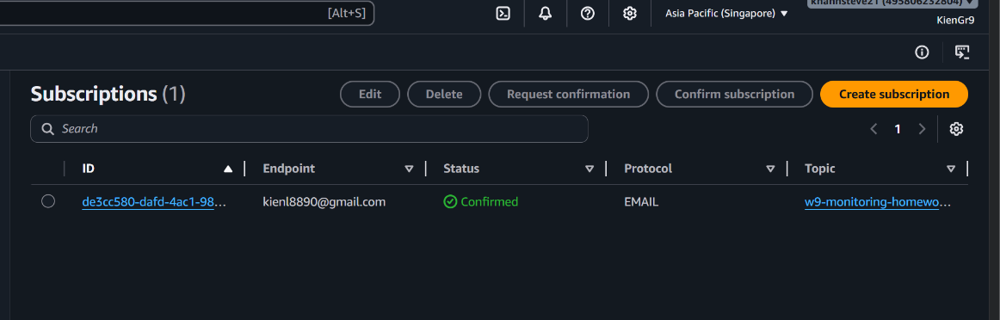
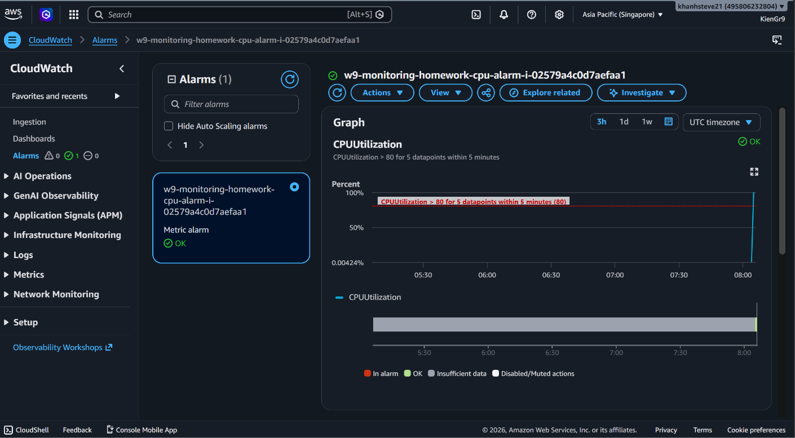
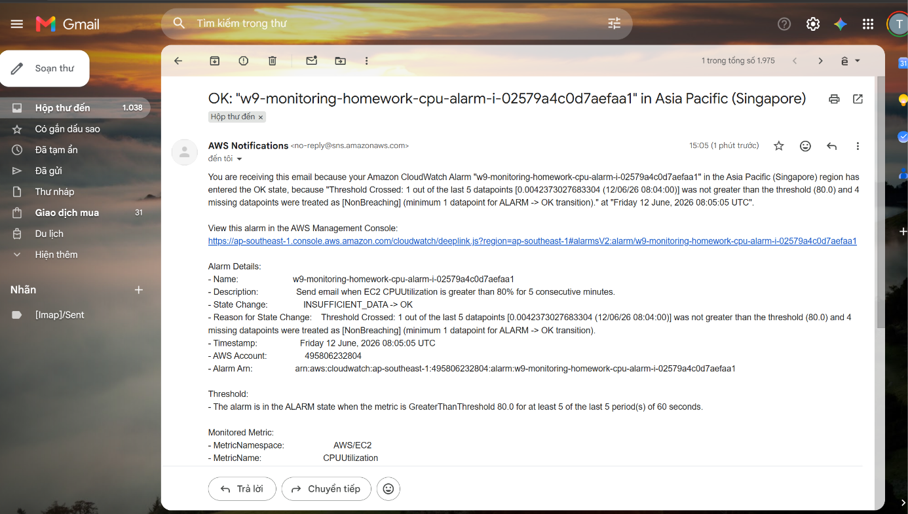
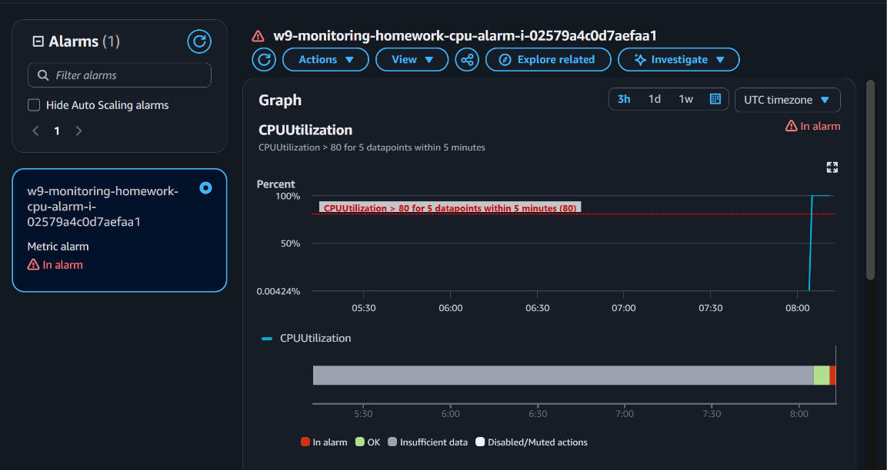
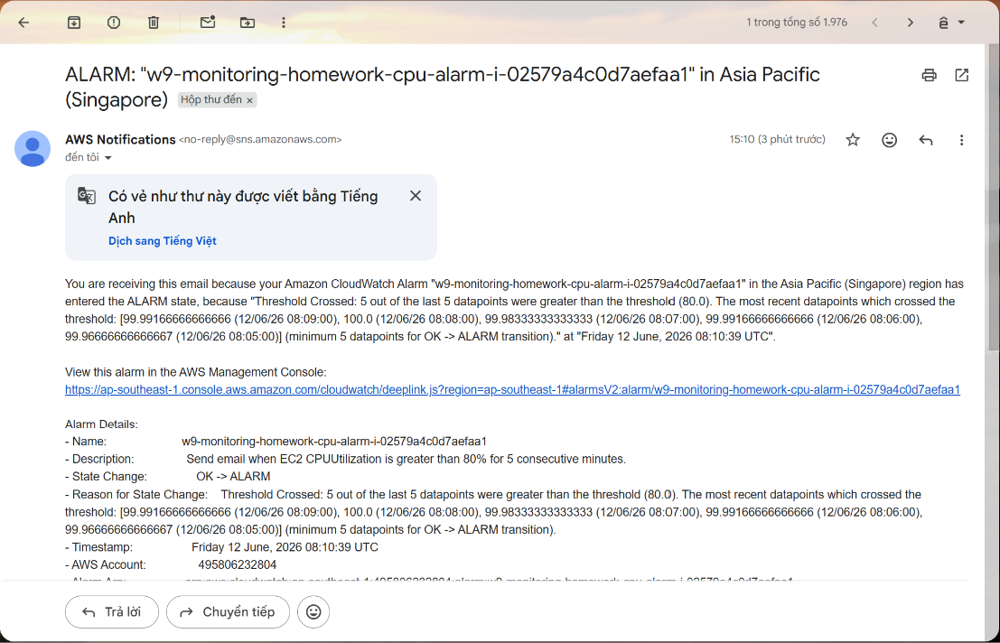
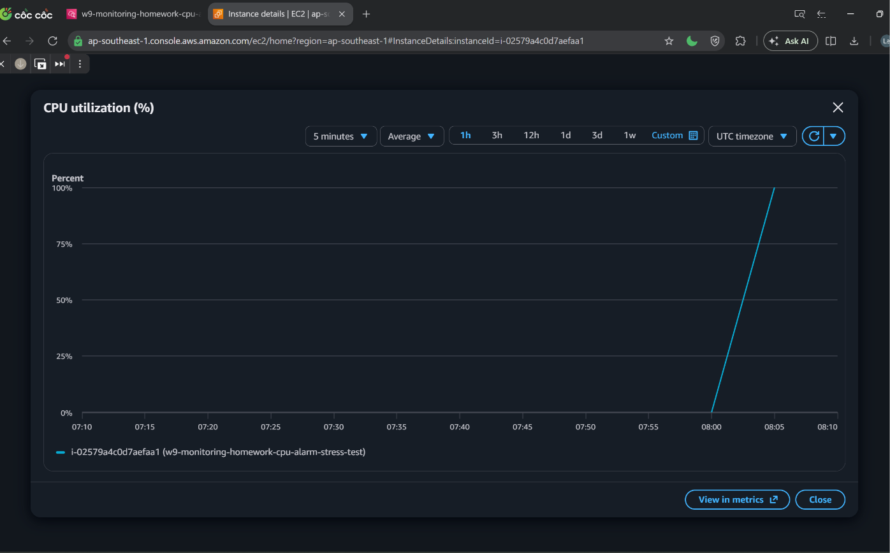
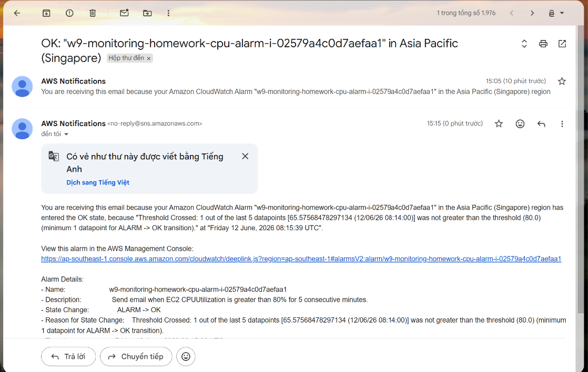

# Homework 01 - CPU Alarm -> Email Alert via SNS

Bài này tạo cảnh báo email khi CPU của một EC2 instance vượt `80%` trong `5` phút liên tiếp.

## Resource được tạo

- SNS Topic nhận cảnh báo.
- SNS Email Subscription gửi email tới người nhận.
- CloudWatch Metric Alarm theo metric `AWS/EC2 CPUUtilization`.
- Tùy chọn: EC2 test chạy user data để đẩy CPU lên cao trong 10 phút.

## Cách chạy

1. Copy file biến mẫu:

```bash
cp terraform.tfvars.example terraform.tfvars
```

2. Sửa `terraform.tfvars`:

```hcl
notification_email = "your-email@example.com"
instance_id        = "i-xxxxxxxxxxxxxxxxx"
```

Nếu muốn Terraform tự tạo EC2 test CPU bằng user data:

```hcl
notification_email   = "your-email@example.com"
create_test_instance = true
instance_id          = null
```

EC2 test sẽ bật detailed monitoring để CloudWatch có datapoint 1 phút. Nếu dùng
EC2 có sẵn, nên bật detailed monitoring cho instance đó để điều kiện `5` phút
liên tiếp hoạt động nhanh và đúng như slide.

3. Chạy Terraform:

```bash
terraform init
terraform plan
terraform apply
```

4. Mở email và bấm xác nhận SNS subscription.

5. Nếu bật `create_test_instance = true`, chờ khoảng 5-8 phút. User data sẽ tự chạy CPU burn trong 10 phút, CloudWatch Alarm sẽ chuyển sang `In alarm` và SNS sẽ gửi email.

6. Chụp evidence:

- `01-sns-subscription-confirmed.png`: SNS subscription đã `Confirmed`.
- `02-cloudwatch-alarm-config.png`: CloudWatch Alarm có threshold CPU `> 80%` và action gửi tới SNS Topic.
- `03-cloudwatch-alarm-in-alarm.png`: Alarm chuyển sang `In alarm` sau khi CPU cao đủ 5 datapoints.
- `04-email-alert-received.png`: Email cảnh báo SNS nhận được trong mailbox.
- Nếu dùng EC2 test, chụp thêm `05-test-ec2-cpu-high.png`: EC2 Monitoring graph CPU tăng cao.

Lưu ảnh vào:

```text
evidence/
```

## Evidence

Bài này chứng minh CloudWatch Alarm theo dõi CPU của EC2, gửi cảnh báo qua SNS
và email nhận được notification khi alarm đổi trạng thái.

### 1. SNS subscription đã xác nhận

SNS Email Subscription đã ở trạng thái `Confirmed`, nghĩa là email đã bấm xác
nhận và có thể nhận notification từ SNS Topic.



### 2. CloudWatch Alarm cấu hình CPU threshold

CloudWatch Alarm theo dõi metric `CPUUtilization` của EC2. Điều kiện alarm là CPU
lớn hơn `80%` trong `5` datapoints, mỗi datapoint `60` giây.



### 3. Email OK ban đầu

SNS gửi email khi alarm ở trạng thái `OK`. Đây là bằng chứng SNS Topic và email
subscription đã hoạt động.



### 4. Alarm chuyển sang In alarm

Sau khi EC2 test chạy CPU cao bằng user data, CloudWatch Alarm chuyển sang trạng
thái `In alarm`.



### 5. Email ALARM đã nhận

Email từ AWS Notifications cho thấy alarm đổi trạng thái từ `OK` sang `ALARM`
vì `5 out of 5` datapoints vượt ngưỡng CPU `80%`.



### 6. CPU EC2 test tăng cao

Biểu đồ EC2 Monitoring cho thấy CPU instance test tăng lên gần `100%`, đúng mục
đích dùng user data để tạo tải CPU.



### 7. Email OK sau khi CPU giảm

Sau khi quá trình CPU burn kết thúc, alarm quay lại `OK` và SNS tiếp tục gửi email
recovery.



## Dọn dẹp

```bash
terraform destroy
```
