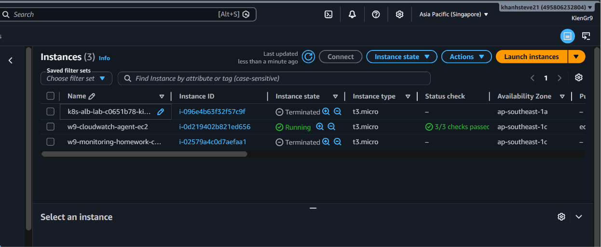
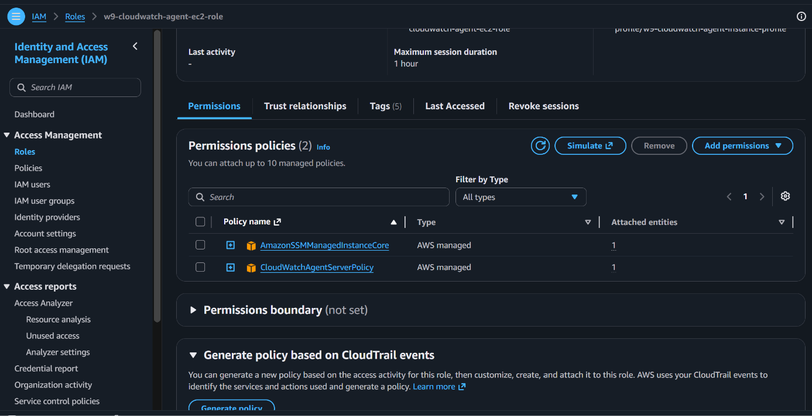
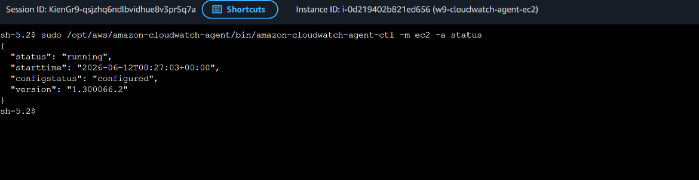
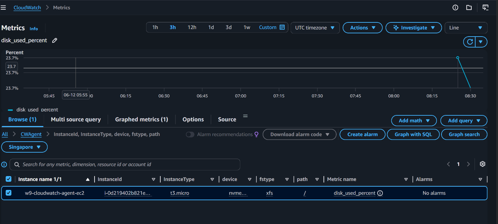
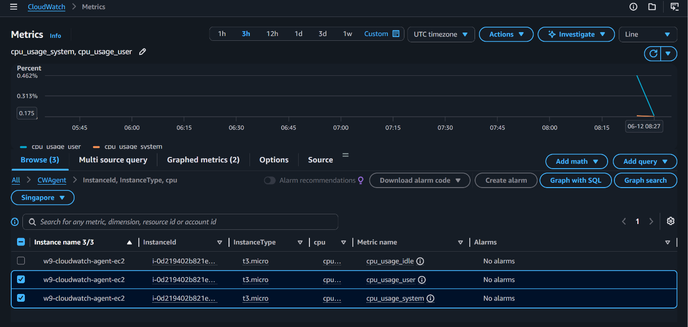
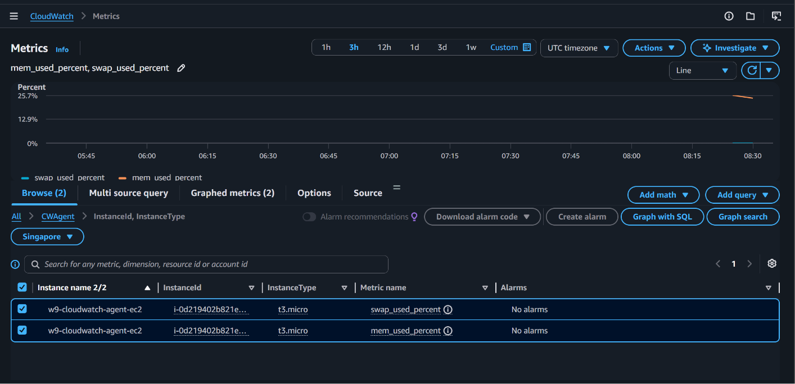
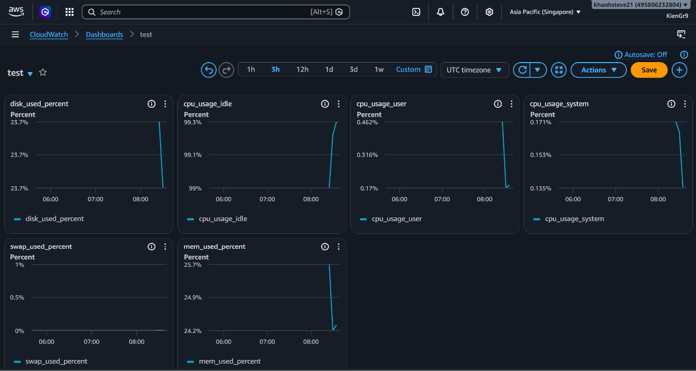

# Homework 02 - Installing the CloudWatch Agent on EC2

Bài này tạo một EC2 lab và tự động cài CloudWatch Agent bằng `user_data`.

## Resource được tạo

- IAM Role cho EC2.
- IAM Instance Profile.
- Policy attachment:
  - `CloudWatchAgentServerPolicy`
  - `AmazonSSMManagedInstanceCore`
- Security Group chỉ cho outbound traffic.
- EC2 Amazon Linux 2023.
- CloudWatch Agent config thu thập CPU, memory, disk và swap.

## Cách chạy

1. Copy file biến mẫu:

```bash
cp terraform.tfvars.example terraform.tfvars
```

2. Sửa `terraform.tfvars` nếu cần đổi region hoặc instance type.

3. Chạy Terraform:

```bash
terraform init
terraform plan
terraform apply
```

4. Chờ EC2 khởi động khoảng 2-3 phút, sau đó kiểm tra:

```bash
aws cloudwatch list-metrics \
  --namespace CWAgent \
  --region ap-southeast-1
```

Nếu dùng Session Manager:

```bash
aws ssm start-session --target <instance-id>
sudo /opt/aws/amazon-cloudwatch-agent/bin/amazon-cloudwatch-agent-ctl -m ec2 -a status
```

## Evidence cần chụp

- EC2 instance đang chạy.
- IAM Role có policy `CloudWatchAgentServerPolicy`.
- CloudWatch Agent status là `running`.
- CloudWatch Metrics namespace `CWAgent` có metric memory/disk.

Lưu ảnh vào:

```text
evidence/
```

## Evidence

Bài này chứng minh EC2 đã có IAM Role đúng quyền, CloudWatch Agent chạy thành công
và gửi custom metrics vào namespace `CWAgent`.

### 1. EC2 instance đang Running

Instance `w9-cloudwatch-agent-ec2` đang chạy và status check `3/3 checks passed`.



### 2. IAM Role có CloudWatch Agent policy

IAM Role của EC2 đã attach `CloudWatchAgentServerPolicy` để gửi metric lên
CloudWatch và `AmazonSSMManagedInstanceCore` để truy cập bằng Session Manager.



### 3. CloudWatch Agent status running

Lệnh kiểm tra agent trên EC2 trả về `"status": "running"` và `"configstatus":
`"configured"`.



### 4. Disk metric trong namespace CWAgent

CloudWatch hiển thị metric `disk_used_percent` trong namespace `CWAgent`.



### 5. CPU metrics trong namespace CWAgent

CloudWatch hiển thị các metric CPU do CloudWatch Agent gửi lên, ví dụ
`cpu_usage_user` và `cpu_usage_system`.



### 6. Memory và swap metrics trong namespace CWAgent

CloudWatch hiển thị `mem_used_percent` và `swap_used_percent`, đây là các metric
không có sẵn trong EC2 basic monitoring nên cần CloudWatch Agent.



### 7. Dashboard tổng hợp metric agent

Dashboard CloudWatch hiển thị nhiều metric từ `CWAgent`, gồm disk, CPU, memory và
swap.



## Dọn dẹp

```bash
terraform destroy
```
