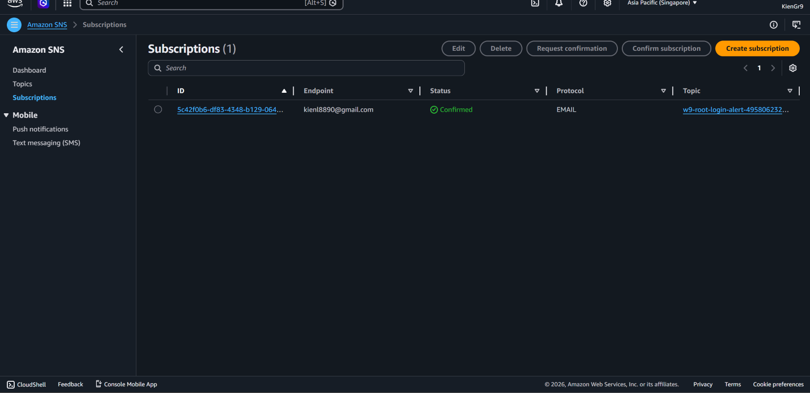
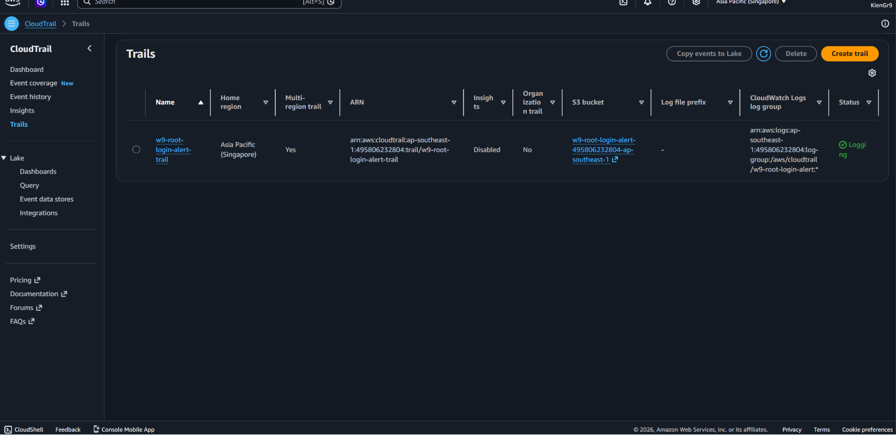
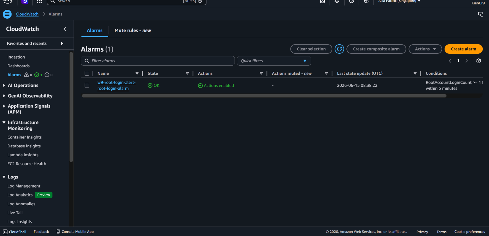
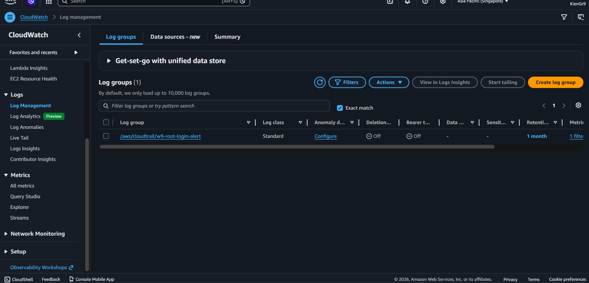
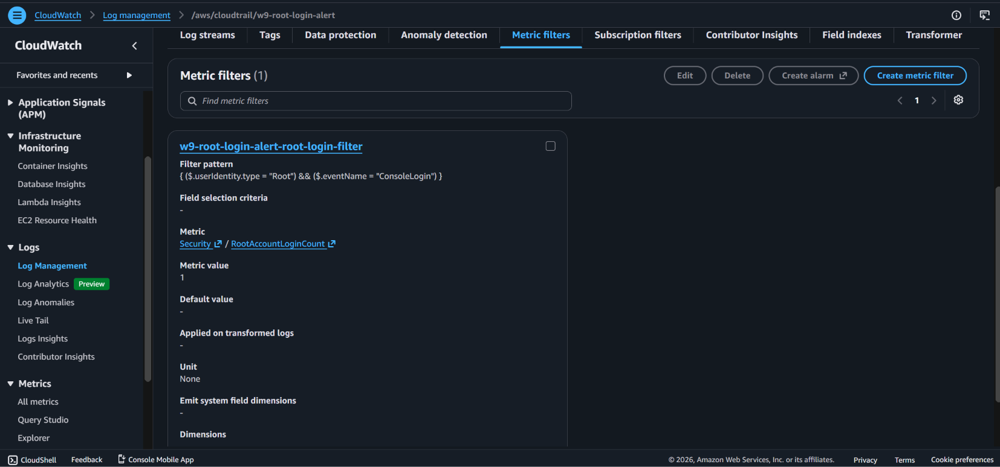
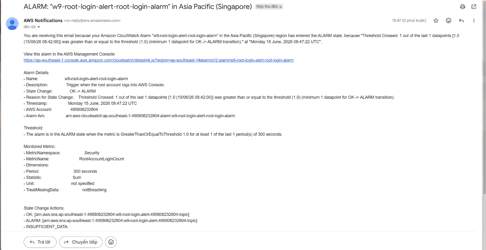
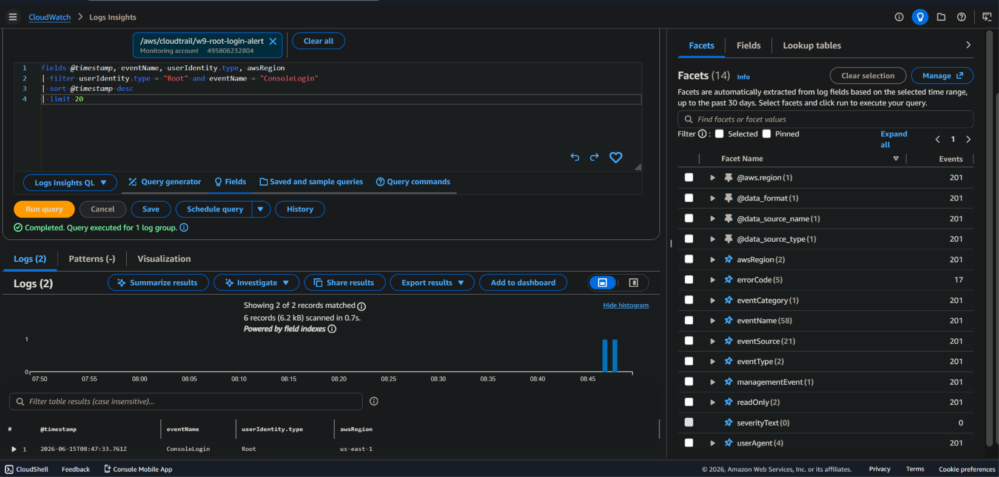
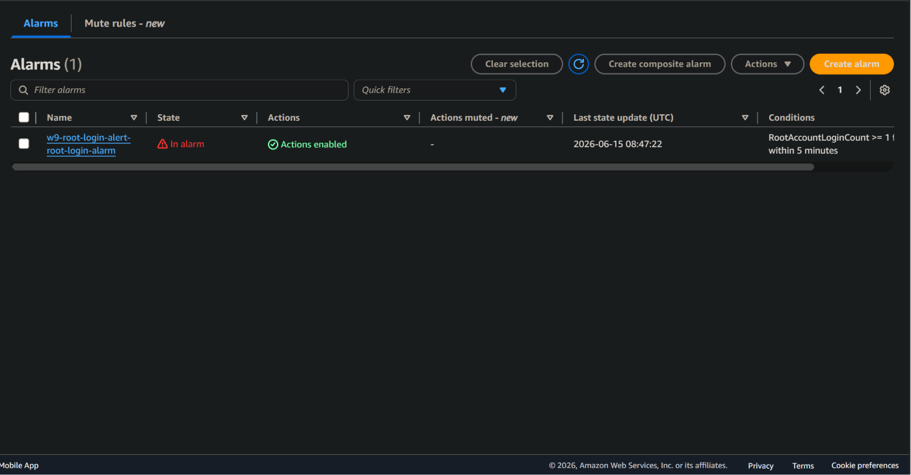

# Homework 03 - Alert on AWS Root Account Login

Bài này tạo cảnh báo khi tài khoản root đăng nhập AWS Console. Luồng chính là:

CloudTrail -> CloudWatch Logs -> Metric Filter -> CloudWatch Alarm -> SNS Email

## Resource được tạo

- S3 bucket cho CloudTrail trail.
- CloudTrail trail ghi management events và gửi log vào CloudWatch Logs.
- CloudWatch Log Group cho CloudTrail.
- Metric Filter nhận diện root `ConsoleLogin`.
- CloudWatch Alarm khi có ít nhất 1 lần root login trong 5 phút.
- SNS Topic và email subscription để gửi cảnh báo.

## Cách chạy

1. Copy file biến mẫu:

```bash
cp terraform.tfvars.example terraform.tfvars
```

2. Sửa `terraform.tfvars`:

```hcl
notification_email = "your-email@example.com"
```

3. Chạy Terraform:

```bash
terraform init
terraform plan
terraform apply
```

4. Mở email và bấm xác nhận SNS subscription.

5. Đăng nhập AWS bằng root account một lần để tạo log thật. Sau đó chờ vài phút cho CloudTrail, metric filter và alarm cập nhật.

6. Chụp evidence:

- `01-sns-subscription-confirmed.png`: SNS subscription đã `Confirmed`.
- `02-cloudtrail-enabled.png`: Trail đã bật và gửi log tới CloudWatch Logs.
- `03-cloudwatch-alarm-config-ok.png`: Alarm đã tạo đúng, theo dõi `RootAccountLoginCount`.
- `04-cloudwatch-log-group-created.png`: Log group CloudTrail đã xuất hiện trong CloudWatch Logs.
- `05-metric-filter-root-login.png`: Metric filter bắt được root `ConsoleLogin`.
- `06-sns-email-alert-received.png`: Email cảnh báo từ SNS.
- `07-logs-insights-root-console-login.png`: Logs Insights nhìn thấy event `Root` + `ConsoleLogin`.
- `08-cloudwatch-alarm-in-alarm.png`: Alarm chuyển sang `In alarm`.

Lưu ảnh vào:

```text
evidence/
```

## Evidence

Bài này chứng minh sự kiện đăng nhập bằng root account được CloudTrail ghi nhận,
CloudWatch chuyển log thành metric, CloudWatch Alarm phát hiện và SNS gửi email
cảnh báo.

### 1. SNS subscription đã xác nhận

Email subscription của SNS ở trạng thái `Confirmed`, sẵn sàng nhận cảnh báo.



### 2. CloudTrail đã bật logging

Trail `w9-root-login-alert-trail` đang `Logging`, là nguồn log gốc cho toàn bộ
luồng phát hiện root login.



### 3. CloudWatch Alarm đã tạo đúng điều kiện

Alarm `w9-root-login-alert-root-login-alarm` theo dõi metric
`RootAccountLoginCount >= 1` trong `5` phút.



### 4. CloudWatch Log Group đã được tạo

CloudTrail đã gửi log về log group `/aws/cloudtrail/w9-root-login-alert`.



### 5. Metric filter bắt root ConsoleLogin

Metric filter dùng pattern bắt `$.userIdentity.type = "Root"` và
`$.eventName = "ConsoleLogin"`, sau đó ghi metric `RootAccountLoginCount` vào
namespace `Security`.



### 6. Email cảnh báo từ SNS đã nhận

Sau khi root login xảy ra, SNS gửi email cảnh báo từ AWS Notifications.



### 7. Logs Insights thấy event Root ConsoleLogin

Logs Insights truy vấn trực tiếp log CloudTrail và xác nhận event
`ConsoleLogin` của `Root` đã xuất hiện.



### 8. CloudWatch Alarm chuyển sang In alarm

CloudWatch Alarm chuyển trạng thái sang `In alarm`, chứng minh metric filter và
alarm đã kích hoạt đúng theo yêu cầu.



## Dọn dẹp

```bash
terraform destroy
```
